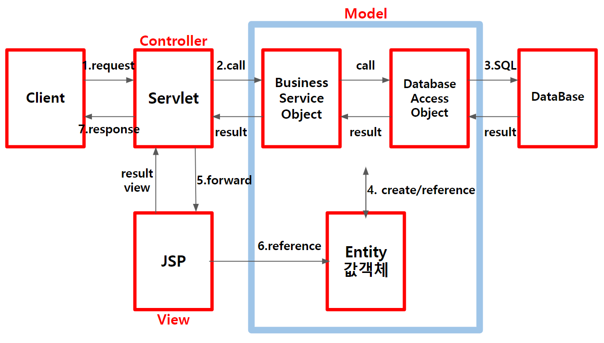
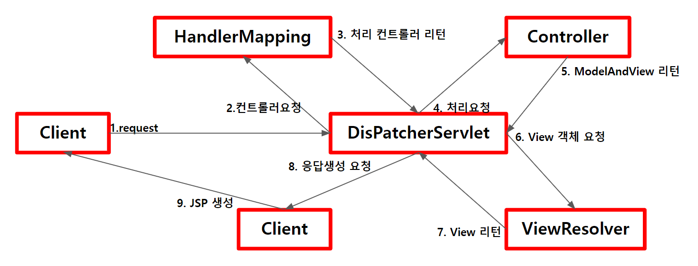
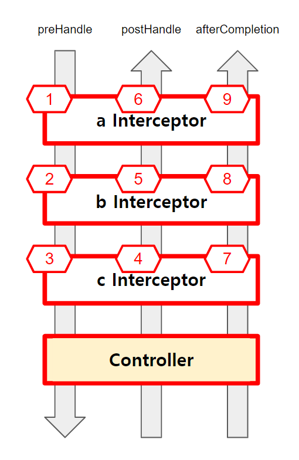

# **Spring** 🐍

### 참고자료

- 토비의 스프링 3.1


## 목차
  - [개요](#개요)
    - [**Spring**의 정의](#spring의-정의)
    - [**POJO**](#pojo)
    - [**IoC/DI**](#iocdi)
    - [**AOP**](#aop)
    - [**PSA**](#psa)
  - [특징](#특징)
    - [IoC](#ioc)
    - [Container](#container)
    - [DI](#di)
  - [MVC(Model-View-Controller)](#mvcmodel-view-controller)
    - [Spring MVC](#spring-mvc)
    - [Spring MVC 실행 순서](#spring-mvc-실행-순서)
    - [Spring MVC 구현](#spring-mvc-구현)
  - [Controller](#controller)
    - [@Controller](#controller-1)
    - [@RequestMapping](#requestmapping)
    - [HTTP method](#http-method)
    - [Controller method의 parameter type](#controller-method의-parameter-type)
    - [@RequestBody parameter type](#requestbody-parameter-type)
    - [Servlet API 사용시기](#servlet-api-사용시기)
    - [Controller Class에서 method의 return type 종류](#controller-class에서-method의-return-type-종류)
  - [View](#view)
  - [Model](#model)
  - [Spring Web Application의 동작순서](#spring-web-application의-동작순서)
  - [FileUpload](#fileupload)
  - [FileDownload](#filedownload)
  - [Interceptor](#interceptor)
  - [MyBatis](#mybatis)
    - [Mapper Interface](#mapper-interface)
    - [MyBatis와 Spring의 연동](#mybatis와-spring의-연동)
  - [REST API](#rest-api)
  - [SpringBoot](#springboot)

<br>

---

## 개요

### **Spring**의 정의

- **자바 엔터프라이즈 개발을 편하게 해주는 오픈소스 경량급 애플리케이션 프레임워크**

  - 애플리케이션 프레임워크

    - 특정 계층이나 기술, 업무 분야에 국한되지 않고 애플리케이션의 전 영역을 포괄하는 범용적인 프레임워크

    - 애플리케이션의 전 영역을 관통하는 일관된 프로그래밍 모델과 핵심 기술을 바탕으로 각 분야의 특성에 맞는 필요를 채워주고 있기 때문에 빠르고 효율적으로 개발할 수 있음

  - 경량급

    - 불필요하게 무겁지 않다는 의미로써 기존 EJB과 비교하여 개발환경과 기술수준이 비슷하더라도 훨씬 빠르고 간편하게 작성할 수 있어 생산성과 품질 면에서 유리함

  - 자바 엔터프라이즈 개발을 편하게

    - 개발자가 복잡하고 실수하기 쉬운 로우레벨 기술에 많은 신경을 쓰지 않으면서도 애플리케이션의 핵심인 사용자의 요구사항, 즉 비즈니스 로직을 빠르고 효과적으로 구현하는 것

### **POJO**

- Plain Old Java Object

  - Spring의 POJO는 IoC/DI + AOP + PSA(Portable Service Abstraction) 를 통해 구현됨

  - 간단한 자바오브젝트라는 의미로써 특정 환경과 기술에 종속되지 않고 필요에 따라 재활용될 수 있는 방식으로 설계된 오브젝트

- 장점

  - 특정한 기술과 환경에 종속되지 않는 오브젝트는 깔끔한 코드가 될 수 있음

  - 유연한 방식으로 원하는 레벨에서 빠르고 명확하게 테스트할 수 있어 자동화된 테스트에 매우 유리함

### **IoC/DI**

- Inversion of Control / Dependency Injection

- 확장에는 열려 있고 변경에는 닫혀 있는 OCP(개방 폐쇄 원칙)으로 설명할 수 있음

- 유연하게 확장 가능한 객체를 만들어 두고 객체 간의 의존관계는 외부에서 다이나믹하게 설정

### **AOP**

- Aspect Oriented Programming

- 프록시를 통해 구현되며 관심사의 분리를 통해 소프트웨어의 모듈성을 향상시켜 공통 모듈을 여러 코드에 쉽게 적용할 수 있음

### **PSA**

- Portable Service Abstraction

- 기술의 변경과 환경에 관계없이 일관된 방식으로 서비스할 수 있게 하는 설계 원칙

<br>

[목차로 이동](#목차)

---

## 특징

- 경량컨테이너

  - 스프링은 자바객체를 담고 있는 컨테이너

  - 스프링 컨테이너는 자바 객체의 라이프사이클을 관리함

- POJO 지원

  - 특정 인터페이스를 구현하거나 또는 클래스를 상속하지 않는 일반 자바 객체 지원

- IoC (Inversion of Control - 제어의 역전)

  - 개발자에게 있던 객체 생성 및 의존 관계 제어권을 컨테이너에게 맡김

  - 객체의 생성과 생명주기를 관리 할 수 있어 스프링 컨테이너라고 부름

- DI 패턴 지원

  - 스프링은 설정 파일이나 어노테이션을 통해 객체 간 의존 관계를 설정할 수 있으므로 직접 생성하거나 검색할 필요가 없음

- AOP 지원

  - 문제를 바라보는 관점을 기준으로 프로그래밍하는 기법

  - 문제를 해결하기 위한 핵심관심 사항과 전체에 적용되는 공통관심 사항을 나누어 프로그래밍

  - 프록시 기반의 AOP로써 트랜잭션, 로깅, 보안과 같은 여러 모듈에서 공통으로 필요로 하지만 모듈의 핵심이 아닌 기능들을 분리하여 각 모듈에 적용

  - JMS, 메일, 스케쥴링 등 엔터프라이즈 애플리케이션 개발에 필요한 다양한 API를 설정 파일과 어노테이션을 통해 손쉽게 사용할 수 있음

<br>

[목차로 이동](#목차)

---

## IoC

- IoC 개념

  - 객체 간의 강한 결합을 다형성으로 인터페이스를 호출하여 결합도를 낮춤

  - 객체 간의 강한 결합을 팩토리를 호출하여 결합도를 낮춤

  - 객체 간의 강한 결합을 Assembler를 통해 결합도를 낮춤

- IoC 방법

  - Dependency Lookup

    > 컨테이너가 lookup context를 통해 필요한 리소스나 오브젝트를 얻는 방식

    - JNDI Lookup

  - Dependency Injection

    > 컨테이너가 직접 의존 구조를 오브젝트에 설정할 수 있도록 지정하는 방식

    - Setter Injection

    - Constructor Injection

    - Method Injection

<br>

[목차로 이동](#목차)

---

## Container

> 객체의 라이프사이클과 애플리케이션 사용에 필요한 주요 기능 제공

- 기능

  - 라이프사이클 관리

  - 의존 객체 제공

  - 스레드 관리

  - 애플리케이션 실행에 필요한 환경

- 필요성

  - 비즈니스 로직 외 부가 기능들에 대해서는 독립적으로 관리

  - 서비스 look up이나 Configuration에 대한 일관성

  - 서비스 객체를 사용하기 위해 각각 Factory 또는 Singleton 패턴을 직접 구현하지 않아도 됨

- IoC Container

  - 오브젝트의 생성과 관계설정, 사용, 제거 등의 작업을 애플리케이션 코드 대신 독립된 컨테이너가 담당

  - 스프링에서 IoC를 담당하는 컨테이너에는 BeanFactory, ApplicationContext가 있음

- DI Container

  - DI Container가 관리하는 객체를 빈(Bean)이라 하고, 빈들의 생명주기를 관리하는 의미로 BeanFactory라 함

    - 일반적으로 BeanFactory 보다는 이를 확장한 ApplicationContext를 사용함

    - getBean() 메서드가 정의되어 있음

  - BeanFactory에 여러 가지 컨테이너 기능을 추가하여 ApplicationContext라 함

    - Spring이 제공하는 ApplicationContext 구현 클래스는 여러가지 종류가 있음

<br>

[목차로 이동](#목차)

---

## DI

- 빈 생성범위

  범위|설명
  :--|:--
  singleton|컨테이너당 인스턴스 생성 (default)
  prototype|빈 요청시마다 인스턴스 생성
  request|HTTP Request별 인스턴스 생성
  session|HTTP Session별 인스턴스 생성

  ```java
  @Scope("prototype")
  public class UserServiceImpl implements UserService {
  }
  ```

  ```xml
  <bean id="userService" class="com.user.service.UserServiceImpl" scope="prototype"/>
  ```

- 스프링 빈 설정 메타정보

  - IoC Container

    - BeanDefinition meta data

      - XML Document

      - Annotation

      - Java Code

- 빈 설정 방법

  - XML
    ```xml
    <?xml version="1.0" encoding="UTF-8"?>
    <beans xmlns="http://www.springframework.org/schema/beans"
      xmlns:xsi="http://www.w3.org/2001/XMLSchema-instance"
      xsi-schemaLocation="http://www.springframework.org/schema/beans
        http://www.springframework.org/schema/beans/spring-beans-4.3.xsd">

      <bean id="userDao" class="com.user.dao.UserDaoImpl"/>
      
      <bean id="userService" class="com.user.service.UserServiceImpl" scope="prototype">
        <property name="userDao" ref="userDao"/>
      </bean>
    </beans>
    ```
    ```java
    ApplicationContext context=new ClassPathXmlApplicationContext("com/user/applicationContext.xml");
    CommonService userService=context.getBean("userServcie", UserService.class);

    // Resource resource=new ClassPathResouce("com/user/applicationContext.xml");
    // BeanFactory factory=new XmlBeanFactory(resource);
    // CommonService userService=(UserService)factory.getBean("userService");
    ``` 

  - Annotation
    ```java
    @Component
    public class UserServiceImpl implements UserService {
      @Autowired
      private UserDao userDao;
    }
    ```
    ```xml
    <?xml version="1.0" encoding="UTF-8"?>
    <beans xmlns="http://www.springframework.org/schema/beans"
      xmlns:xsi="http://www.w3.org/2001/XMLSchema-instance"
      xsi-schemaLocation="http://www.springframework.org/schema/beans
        http://www.springframework.org/schema/beans/spring-beans-4.3.xsd">

      <context:component-scan base-package="com.user.*"/>
    </beans>
    ``` 
    
    Stereotype|대상
    :--|:--
    @Repository|Data Access Layer의 DAO 또는 Repository 클래스에 사용
    @Service|Service Layer의 클래스에 사용
    @Controller|Presentation Layer의 MVC Controller에 사용
    @Component|Layer 구분을 적용하기 어려운 일반적인 경우에 사용

    - annotation을 구분하는 이유

      - 계층별로 빈의 특성이나 종류를 구분

      - AOP Pointcut 표현식을 사용하면 특정 annotation이 달린 클래스만 설정 가능

      - 특정 계층의 빈에 부가기능을 부여할 수 있음

<br>

[목차로 이동](#목차)

---

> ## MVC(Model-View-Controller)
>- MVC란?
>>- Application의 원활한 확장을 위해 Model, View, Controller 3가지 영역으로 분리함
>>- Component의 변경이 다른 영역 Component에 영향을 미치지 않아 유지보수에 용이함
>>- 컴포넌트 간의 결합성이 낮아 프로그램 수정이 용이하여 확장성이 뛰어남
>- 장점
>>- 화면과 비즈니스 로직을 분리하여 작업 가능 
>>- 영역별 개발로 인하여 확장성이 뛰어남
>>- 표준화된 코드를 사용하므로 공동작업이 용이하고 유지보수성이 좋음
>- 단점
>>- 개발과정이 다소 복잡하여 초기 개발속도가 늦음
>>- 초보자가 이해하고 개발하기에 다소 어려움
>- Model 역할
>>- Application 캡슐화
>>- 상태 쿼리에 대한 응답
>>- 어플리케이션의 기능 표현
>>- 변경을 view에 통지
>- View 역할
>>- Model을 시각적으로 표현
>>- Model에게 업데이트 요청
>>- 사용자의 입력을 Controller에 전달
>>- Controller가 View를 선택하도록 허용
>- Controller
>>- Application의 행위 정의
>>- 사용자 액션을 Model로 업데이트하고 mapping
>>- 응답에 대한 View 선택   
>- Model2 요청 흐름 시각화
> 

<br>

[목차로 이동](#목차)

> ### Spring MVC
>- 특징
>>- Spring은 DI, AOP기능 뿐만 아니라, Servlet 기반의 WEB 개발을 위한 MVC Framework를 제공함
>>- Model2 Architecture와 Front Controller Pattern을 Framework 차원에서 제공함
>>- Spring MVC Framework는 Spring을 기반으로 하고 있어 Spring이 제공하는 Transaction 처리나 DI, AOP등을 손쉽게 사용할 수 있음
>- 구성요소
>>- DispatcherServlet (Front Controller)
>>>- 모든 클라이언트의 요청을 처리함
>>>- Controller에게 클라이언트의 요청을 전달하고 Controller가 리턴한 결과값을 View에게 전달하여 알맞은 응답을 생성함
>>- HandlerMapping
>>>- 클라이언트의 요청 URL을 어떤 Controller가 처리할지 결정함
>>>- URL과 요청 정보를 기준으로 어떤 핸들러 객체를 사용할지 결정하는 객체이며, DispatcherServlet은 하나 이상의 핸들러 매핑을 가질 수 있음
>>- Controller
>>>- 클라이언트의 요청을 처리한 뒤, Model을 호출하고 그 결과를 DispatcherServlet에 알려줌
>>- ModelAndView
>>>- Controller가 처리한 데이터 및 화면에 대한 정보를 보유한 객체
>>- ViewResolver
>>>- Controller가 리턴한 View 이름을 기반으로 Controller의 처리 결과를 보여줄 View를 결정
>>- View
>>>- Controller의 처리결과를 보여줄 응답화면을 생성

<br>

[목차로 이동](#목차)

> ### Spring MVC 실행 순서
>> 
>>1. DispatcherServlet 이 요청을 수신
>>>- 단일 Front Controller Servlet 
>>>- 요청을 수신하여 처리를 다른 컴포넌트에 위임
>>>- 어느 Controller에 요청을 전송할지 결정
>>2. DispatherServlet이 HandlerMapping에 어느 Controller를 사용할 것인지 문의
>>>- URL과 Mapping
>>3. DispatcherServlet 은 요청을 Controller에게 전송하고 Controller는 요청을 처리한 후 결과 리턴
>>>- Business Logic 수행 후 결과 정보(Model)가 생성되어 JSP와 같은 View에서 사용됨
>>4. ModelAndView Object에 수행결과가 포함되어 DispatcherServelt에 리턴
>>5. ModelAndView 는 실제 JSP 정보를 갖고 있지 않으며, ViewResolver가 논리적 이름을 실제 JSP이름으로 변환함
>>6. View는 결과정보를 사용하여 화면을 표현함

<br>

[목차로 이동](#목차)

> ### Spring MVC 구현
>- Spring MVC를 이용한 Application 구현 순서
>>1. web.xml에 DispatcherServlet 등록 및 Spring 설정파일 등록
>>2. 설정 파일에 HandlerMapping 설정
>>3. Controller 구현 및 servlet-context.xml에 등록
>>4. Controller와 JSP의 연결을 위해 View Resolver 설정
>>5. JSP 코드 작성
>- Controller 작성
>>- Controller가 많은 일을 하지 않고 Service에 처리를 위임하도록 작성한다
>- web.xml -  DispatcherServlet 설정
>> ```xml
>> <servlet>
>>   <servlet-name>appServlet</servlet-name>
>>   <servlet-class>org.springframework.web.servlet.DispatcherServlet</servlet-class>
>>   <init-param>
>>     <param-name>contextConfigLocation</param-name>
>>     <param-value>/WEB-INF/spring/appServlet/servlet-context.xml</param-value>
>>   </init-param>
>>   <load-on-startup>1</load-on-startup>
>> </servlet-name>
>> 
>> <servlet-mapping>
>>   <servlet-name>appServlet</servlet-name>
>>   <url-pattern>/</url-pattern>
>> </servlet-mapping>
>> ```
>>- \<init-param>을 설정하지 않으면 "\<servlet-name>-servlet.xml" 에서 applicationContext의 정보를 로드함
>>- 스프링 컨테이너는 설정파일의 내용을 읽고 ApplicationContext객체를 생성함
>>- \<url-pattern>에 DispatcherServlet이 처리하는 URL Mappling pattern을 정의함
>> ```xml
>> <servlet>
>>   <servlet-name>appServlet</servlet-name>
>>   <servlet-class>org.springframework.web.servlet.DispatcherServlet</servlet-class>
>>   <init-param>
>>     <param-name>contextConfigLocation</param-name>
>>     <param-value>/WEB-INF/spring/appServlet/servlet-context.xml</param-value>
>>   </init-param>
>>   <load-on-startup>1</load-on-startup>
>> </servlet-name>
>> <servlet>
>>   <servlet-name>appServlet2</servlet-name>
>>   <servlet-class>org.springframework.web.servlet.DispatcherServlet</servlet-class>
>>   <init-param>
>>     <param-name>contextConfigLocation</param-name>
>>     <param-value>/WEB-INF/spring/appServlet/servlet-context2.xml</param-value>
>>   </init-param>
>>   <load-on-startup>1</load-on-startup>
>> </servlet-name>
>> 
>> <servlet-mapping>
>>   <servlet-name>appServlet</servlet-name>
>>   <url-pattern>*.do</url-pattern>
>> </servlet-mapping>
>> <servlet-mapping>
>>   <servlet-name>appServlet</servlet-name>
>>   <url-pattern>*.action</url-pattern>
>> </servlet-mapping>
>> ```
>>- 서블릿이므로 1개 이상의 DispatcherServlet 설정 가능
>>>- 각 DispatcherServlet마다 각각의 ApplicationContext 생성
>>- \<load-on-startup>1\</load-on-startup> 설정 시 WAS startup 될때 초기화 작업이 진행됨
>- web.xml - 최상위 Root ContextLoader 설정
>>- Context 설정 파일들을 로드하기 위해 web.xml 파일에 리스너 설정
>> ```xml
>> <listener>
>>   <listener-class>org.springframework.context.ContextLoaderListener</listener-class>
>> </listener>
>> ```
>>- 리스너 설정시 /WEB-INF/spring/root-context.xml 파일을 읽어 공통적으로 사용되는 최상위 Context를 생성
>>- 그 외의 다른 컨텍스트 파일들을 최상위 어플리케이션 컨텍스트에 로드하는 방법
>>> ```xml
>>> <context-param>
>>>   <param-name>contextConfigLocation</param-name>
>>>   <param-value>
>>>     /WEB-INF/spring/root-context.xml
>>>     classpath:com/test/web/application.xml <!-- 해당 클래스 패스에 위치한 설정파일로부터 다른 컨텍스트 파일 로드 -->
>>>   </param-value>
>>> </context-param>
>>> ```
>>> ```xml
>>> <!-- com/test/web/application.xml -->
>>> <context-param>
>>>   <param-name>contextConfigLocation</param-name>
>>>   <param-value>
>>>     /WEB-INF/spring/root-*.xml
>>>   </param-value>
>>> </context-param>
>>> ```
>- Application Context 분리
>>- 어플리케이션 레이어에 따라 어플리케이션 컨텍스트를 분리
>>> Layer|설정파일
>>> :--|:--
>>> Security|board-security.xml
>>> Web|board-servlet.xml
>>> Service|board-service.xml
>>> Persistence|board-dao.xml
>- Controller Class 작성
>> ```java
>> @Slf4j
>> @Controller
>> public class HomeController{
>>   //@GetMapping({"/", "/index"})
>>   @RequestMapping(value={"/", "/index"}, method=RequestMethod.GET)
>>   public String home(Model m) {
>>     log.info("방문요청");
>>     m.addAttribute("msg","방문환영");
>>     return "index";
>>   }
>> }
>> ```
>- Context 설정파일에 Controller 등록 (servlet-context.xml)
>> ```xml
>> <beans:bean class="com.text.web.HomeController" />
>> ```
>- Controller와 response page 연결을 위한 ViewResolver 설정 (servlet-context.xml)
>> ```xml
>> <beans:bean class="com.text.web.HomeController" />
>> 
>> <beans:bean class="org.springframework.web.servlet.view.InternalResourceViewResolver">
>>   <beans:property name="prefix" value="/WEB-INF/views/" />
>>   <beans:property name="suffix" value=".jsp" />
>> </beans:bean>
>> ```

<br>

[목차로 이동](#목차)

---

>## Controller
>- @Controller와 @RequestMapping 어노테이션
>>- 메서드 단위의 mapping 가능
>>- DefaultAnnotationHandlerMapping과 AnnotationHandlerAdapter를 사용
>>>- Spring 3.0부터 기본 설정이므로 별도의 설정없이 사용가능

<br>

[목차로 이동](#목차)

>### @Controller
>- Controller class는 Client의 요청을 처리함
>- Class 타입에 적용되며 Spring 3.0부터 @Controller 사용이 권장됨
>- 세부 적용
>>- Controller Class를 <bean>에 등록
>>> ```xml
>>> <beans:bean id="userController" class="com.movie.user.controller.UserController">
>>>  <beans:property name="userService" ref="userService"/>
>>> </beans:bean>
>>> ```
>>- Controller Class 자동스캔
>>> ```xml
>>> <context:component-scan base-package="com.movie.user.controller" />
>>> ```
>>>- context:component-scan 의 base-package에 설정된 패키지내의 class중 @Controller가 적용된 클래스는 자동스캔 대상이 됨

<br>

[목차로 이동](#목차)

>### @RequestMapping
>>- 요청 URL mapping 정보를 설정하며 클래스타입과 메소드에 설정할 수 있음
>> ```java
>> @Controller
>> @RequestMapping("/user")
>> public class UserController {
>>  private UserService userService;
>>  
>>  //@RequestMapping("/user/regist.do")
>>  @RequestMapping("/regist.do")
>>  public String regist() {
>>    return "user/regist";
>>  }
>> }
>> ```

<br>

[목차로 이동](#목차)

>### HTTP method
>>- 같은 URL 요청에 대하여 HTTP method(GET, POST..)에 따라 다른 메서드 mapping 가능
>> ```java
>> @Controller
>> @RequestMapping("/user")
>> public class UserController {
>>  private UserService userService;
>>  
>>  @RequestMapping("/regist.do", method=RequestMethod.GET)
>>  public String regist() {
>>    return "user/regist";
>>  }
>>
>>  @RequestMapping("/regist.do", method=RequestMethod.POST)
>>  public String regist2() {
>>    return "user/regist";
>>  }
>> }
>> ```
>>- Controller class에 매핑이 되어있는데 메서드에 매핑설정이 없으면 HTTP ERROR 404
>> ```java
>> @Controller
>> @RequestMapping("/user")
>> public class UserController {
>>  private UserService userService;
>>  
>>  @RequestMapping(method=RequestMethod.GET) // HTTP ERROR 404 (Not Found)
>>  public String regist() {
>>    return "user/regist";
>>  }
>> }
>> ```

<br>

[목차로 이동](#목차)

>### Controller method의 parameter type
>- Controller method의 parameter로 다양한 Object를 받을 수 있음
>> Parameter Type|설명
>> :--|:--
>> HttpServletRequest|
>> HttpServletResponse|필요시 Servlet API를 사용할 수 있음
>> HttpSession|
>> Java.util.Locale|현재 요청에 대한 위치관련정보를 사용할 수 있음
>> InputStream, Reader|요청 컨텐츠에 직접 접근할 때 사용
>> OutputStream, Writer|응답 컨텐츠를 생성할 때 사용
>> @PathVariable annotation 적용 파라미터|URI 템플릿 변수에 접근할 때 사용
>> @RequestParam annotation 적용 파라미터|HTTP 요청 파라미터를 매핑
>> @RequestHeader annotation 적용 파라미터|HTTP 요청 헤더를 매핑
>> @CookieValue annotation 적용 파라미터|HTTP 쿠키 매핑
>> @RequestBody annotation 적용 파라미터|HTTP 요청의 body 내용에 접근할 때 사용
>> Map, Model, ModelMap|view에 전달할 model data를 설정할 때 사용
>> 커맨드 객체(DTO)|HTTP 요청 parameter를 저장한 객체
>> &nbsp;|기본적으로 클래스 이름을 모델명으로 사용
>> &nbsp;|@ModelAttribute annotation 설정으로 모델명을 설정할 수 있음
>> Errors, BindingResult|HTTP 요청 파라미터를 커맨더 객체에 저장한 결과
>> &nbsp;|커맨드 객체를 위한 파라미터 바로 다음에 위치
>> SessionStatue|폼 처리를 완료 했음을 처리하기 위해 사용
>> &nbsp;|@SessionAttributes annotation을 명시한 session 속성을 제거하도록 이벤트 발생
>- @RequestParam annotation을 이용한 parameter mapping
>> ```java
>> @Controller
>> public class UserController {
>>  private UserService userService;
>>  
>>  // URL 호출 : http://localhost/user/regist?name=홍길동&age=30
>>
>>  @RequestMapping(value="/regist" method=RequestMethod.GET)
>>  //public String regist(@RequestParam("name") String name, @RequestParam("age") int age, Model model) {
>>  public String regist(@RequestParam(value="name", required=false) String name, @RequestParam(value="age", defaultValue="25") int age, Model model) {
>>    model.addAttribute("msg", name+"("+age+")님 환영합니다");
>>    return "index";
>>  }
>> }
>> ```
>- form에 입력한 data를 JavaBean 객체를 이용하여 전송할 수 있고 List로도 가능함
>> ```html
>> <form method="POST" action="${root}/user/regist">
>>   이름: <input type="text" name="name"><br>
>>   나이: <input type="nubmer" name="age"><br>
>>   <input type="submit" value="회원가입">
>></form>
>> ```
>> ```java
>> @Controller
>> @RequestMapping("/user")
>> public class UserController {
>>   @RequestMapping(value="/regist", method=RequestMethod.POST)
>>   public String regist(UserDto userDto) {
>>     return "user/regist_result";
>>   }
>> }
>> ```
>> ```java
>> public class UserDto {
>>   private String name;
>>   private int age;
>> 
>>   //setters
>> }
>> ```
>- View에서 Command 객체에 접근
>>- Command 객체는 자동으로 반환되는 Model에 추가되고, view에서 접근이 가능함
>- @CookieValue annotation을 이용한 Cookie mapping
>> ```java
>> @Controller
>> public class HomeController {
>>   //public String hello(@CookieValue("author") String authorValue) {
>>   public String hello(@CookieValue(value="author", required=false, defaultValue="user") String authorValue) {
>>     return "ok";
>>   }
>> }
>> ```
>- @RequestHeader annotation을 이용한 header mapping
>> ```java
>> @Controller
>> public class HomeController {
>>   public String hello(@RequestHeader("Accept-Language") String authorValue) {
>>     return "ok";
>>   }
>> }
>> ```

<br>

[목차로 이동](#목차)

>### @RequestBody parameter type
>- HTTP 요청 Body가 그대로 객체에 전달됨
>- AnnotationMethodHandlerAdapter에는 HttpMessageConverter 타입의 메시지 변환기가 기본으로 여러개 등록되어 있음
>- @RequestBody가 붙은 parameter가 있으면 해당 미디어 타입을 확인 후 처리 가능한 변환기가 자동으로 객체로 변환시켜 줌
>- 주로 @ResponseBody와 함께 사용되며 비동기처리됨

<br>

[목차로 이동](#목차)

>### Servlet API 사용시기
>- HttpSession의 생성을 직접 제어해야 하는 경우
>- Controller가 Cookie를 생성해야 하는 경우
>- Servlet API를 선호하는 경우
>- Servlet API의 종류
>>- javax.servlet.ServletRequest / javax.servlet.http.HttpServletRequest
>>- javax.servlet.ServletResponse / javax.servlet.http.HttpServletResponse
>>- javax.servlet.http.HttpSession
> ```java
> @Controller
> public class HomeController {
>   public String hello(HttpServletRequest request, HttpServletResponse response) {
>     return "ok";
>   }
> }
> ```

<br>

[목차로 이동](#목차)

>### Controller Class에서 method의 return type 종류
> Return Type|설명
> :--|:--
> ModelAndView|model 정보 및 view 정보를 담고있는 객체
> Model|view에 전달할 객체 정보를 담고있는 Model을 반환한다. view이름은 요청 URL로부터 결정됨(RequestToViewNameTranslator)
> Map|view에 전달할 객체 정보를 담고있는 Map을 반환한다. view이름은 요청 URL로부터 결정됨(RequestToViewNameTranslator)
> String|view의 이름을 반환함
> View|view 객체를 직접 리턴, 해당 View 객체를 이용해서 view를 생성함
> void|method가 ServletResponse나 HttpServletResponse타입의 parameter를 갖는 경우 method가 직접 응답을 처리한다고 가정한다. 그렇지 않을 경우 요청 URL로부터 결정된 View를 보여준다 (RequestToViewNameTranslator)
> @ResponseBody Annotation 적용|method에서 @ResponseBody annotation이 적용된 경우, 리턴 객체를 HTTP 응답으로 전송함. HttpMessageConverter를 이용해서 객체를 HTTP 응답 스트림으로 변환함

<br>

[목차로 이동](#목차)

---

>## View
>- View 지정
>>- Controller에서는 처리결과를 보여줄 View 이름이나 객체를 리턴하고, DispatcherServlet은 View이름이나 View객체를 이용하여 view를 생성
>- ViewResolver
>>- 논리적 view와 실제 JSP파일 mapping
>>- servlet-context.xml
>>>```xml
>>><beans:bean class="org.springframework.web.servlet.view.InternalResourceViewResolver">
>>>  <beans:property name="prefix" value="/WEB-INF/views/" />
>>>  <beans:property name="suffix" value=".jsp" />
>>></beans:bean>
>>>```
>- View 이름 명시적 지정
>>- ModelAndView 와 String 리턴 타입
>>>```java
>>> @Controller
>>> public class HomeController {
>>>   @RequestMapping("/hello")
>>>   public ModelAndView hello(){
>>>     ModelAndView mav=new ModelAndView("hello");
>>>     return mav;
>>>   }
>>>   @RequestMapping("/hello")
>>>   public ModelAndView hello(){
>>>     ModelAndView mav=new ModelAndView();
>>>     mav.setViewNmae("hello");
>>>     return mav;
>>>   }
>>>   @RequestMapping("/hello")
>>>   public String hello(){
>>>     return "hello";
>>>   }
>>> }
>>>```
>- View 이름 자동 지정
>>- RequestToViewNameTranslator를 이용하여 URL로 부터 view이름을 결정
>>- 자동 지정 유형
>>>- return type이 Model이나 Map인 경우
>>>- return type이 void이면서 ServletResponse나 HttpServletResponse 타입의 parameter가 없는 경우
>>>```java
>>> @Controller
>>> public class HomeController {
>>>   @RequestMapping("/hello") // hello가 view 이름이 됨
>>>   public Map<String, Object> hello(){
>>>     Map<String, Object> model=new HashMap<String, Object>();
>>>     return model;
>>>   }
>>> }
>>>```
>- redirect view
>>- View 이름에 "redirect:" 접두어를 붙이면 지정한 페이지로 리다이랙트
>>>```java
>>> @Controller
>>> public class HomeController {
>>>   @RequestMapping("/hello")
>>>   public Map<String, Object> hello(){
>>>     return "redirect:index";
>>>   }
>>> }
>>>```

<br>

[목차로 이동](#목차)

---

>## Model
>- View에 전달하는 데이터
>>- @RequestMapping annotation이 적용된 method의 Map, Model, ModelMap
>>> ```java
>>> @Controller
>>> public class HomeController {
>>>   @RequestMapping("/hello")
>>>   public String hello(Map model){
>>>   //public String hello(ModelMap model){
>>>   //public String hello(Model model){
>>>     model.put("msg", "어서오세요");
>>>     return "hello";
>>>   }
>>> }
>>> ```
>>>- Model Interface 주요 method
>>>>- Model addAttribute(String name, Object value);
>>>>- Model addAttribute(Object value);
>>>>- Model addAllAttributes(Collection<?> values);
>>>>- Model addAllAttributes(Map<String, ?> attributes);
>>>>- Model mergeAttributes(Map<String, ?> attributes);
>>>>- boolean containsAttribute(String name);
>>- @RequestMapping method가 return하는 ModelAndView
>>>- Controller에서 처리결과를 보여줄 view와 view에 전달할 값(model)을 저장하는 용도로 사용
>>>>```java
>>>> @Controller
>>>> public class HomeController {
>>>>   @RequestMapping("/hello")
>>>>   public ModelAndView hello(){
>>>>     ModelAndView mav=new ModelAndView();
>>>>     mav.setViewName("hello");
>>>>     mav.addObject("msg", "어서오세요");
>>>>     return mav;
>>>>   }
>>>> }
>>>>```
>>- @ModelAttribute annotation이 적용된 method가 return 한 객체
>>>- @RequestMapping annotation이 적용되지 않은 별도 method로 모델이 추가될 객체를 생성
>>>> ```java
>>>> @Controller
>>>> public class HomeController {
>>>>   @ModelAttribute("modelmsg")
>>>>   public String msg() {
>>>>     return "bye";
>>>>   }
>>>>   
>>>>   @RequestMapping("/hello")
>>>>   public String hello(Map model){
>>>>     model.put("msg", "어서오세요");
>>>>     return "hello";
>>>>   }
>>>> }
>>>> ```
>>>> ```html
>>>> <div align="center">
>>>> <h3>hello</h3>
>>>> ${msg}<br>
>>>> ${modelmsg}<br>
>>>> <a href="${root}/user/regist">회원가입</a>
>>>> </div>
>>>> ```
>- 요청 URL 매칭
>>- 전체 경로와 Servlet 기반 경로 매칭
>>>- DispatcherServlet은 DefaultAnnotationHandlerMapping Class를 기본으로 HandlerMapping 구현체로 사용
>>>- Default로 Context내의 경로가 아닌 Servlet 경로를 제외한 나머지 경로에 대해 mapping
>>>```xml
>>><servlet>
>>>  <servlet-name>dispatcher</servlet-name>
>>>  <servlet-class>org.springframework.web.servlet.DispatcherServlet</servlet-class>
>>>  <load-on-startup>1</load-on-startup>
>>></servlet>
>>><servlet-mapping>
>>>  <servlet-name>dispatcher</servlet-name>
>>>  <url-pattern>*.html</url-pattern>
>>>  <url-pattern>/product/*</url-pattern>
>>></servlet-mapping>
>>>```
>>- Servlet 기반 경로 매칭
>>>- Servlet 경로를 포함한 전체 경로를 이용해서 매칭하려는 경우
>>>- @RequestMapping("/user/regist")
>>>>```xml
>>>><bean class="org.springframework.web.servlet.mvc.annotation.DefaultAnnotationHandlerMapping">
>>>>  <property name="alwaysUseFullPath" value="true" />
>>>></bean>
>>>>
>>>><bean class="org.springframework.web.servlet.mvc.annotation.AnnotationMethodHandlerAdapter">
>>>>  <property name="alwaysUseFullPath" value="true" />
>>>></bean>
>>>>```
>>- @PathVariable annotation을 이용한 URI 템플릿
>>>- RESTful 방식
>>>>- **http**://localhost/users/troment
>>>>- **http**://localhost/product/
>>>>- **http**://localhost/forum/board/10
>>>- @RequestMapping Annotation 값으로 {템플릿변수}를 사용
>>>- @PathVariable Annotation을 이용해서 {템플릿변수}와 동일한 이름을 갖는 parameter를 추가
>>>>```java
>>>> @Controller
>>>> public class BoardViewController {
>>>>   @RequestMapping("/{id}/board/{num}")
>>>>   public String view(@PathVariable String id, @PathVariable int num, Model model){
>>>>     Board board=boardService.getBoard(id, num);
>>>>     return "view";
>>>>   }
>>>> }
>>>>```
>>>>```java
>>>> @Controller
>>>> @RequestMapping("/{id}")
>>>> public class BoardViewController {
>>>>   @RequestMapping("/board/{num}")
>>>>   public String view(@PathVariable String id, @PathVariable int num, Model model){
>>>>     Board board=boardService.getBoard(id, num);
>>>>     return "view";
>>>>   }
>>>> }
>>>>```
>>>- @RequestMapping Annotation의 추가설정 방법
>>>>- Ant 스타일의 URI패턴 지원
>>>>>- ? : 하나의 문자열과 대치
>>>>>- * : 하나 이상의 문자열과 대치
>>>>>- ** : 하나 이상의 디렉토리와 대치
>>>>>```java
>>>>>@RequestMapping("/member/*.do")
>>>>>@RequestMapping("/*/board/{num}")
>>>>>```

<br>

[목차로 이동](#목차)

---

>## Spring Web Application의 동작순서
>1. 웹 어플리케이션이 실행되면 WAS(Tomcat)에 의해 web.xml이 로딩
>2. web.xml에 등록되어 있는 ContextLoaderListener (Java Class)가 생성되고 ContextLoaderListener class는 ServletContextListener interface를 구현하고 있으며, ApplicationContext를 생성하는 역할을 수행
>3. 생성된 ContextLoaderListener는 root-context.xml을 로딩
>4. root-context.xml에 등록되어 있는 스프링 컨테이너가 구동되어 개발자가 작성한 비지니스 로직(Service)에 대한 부분과 DAO, VO 객체들이 생성
>5. 클라이언트로부터 request
>6. DispatcherServlet이 생성되며 FrontController의 역할을 수행
>>- 클라이언트의 요청을 분석하여 알맞은 컨트롤러에게 전달하고 응답을 받아 요청에 따른 응답을 어떻게 할 지 결정
>>- HandlerMapping, ViewResolver Class라고 부름
>7. DispatcherServlet은 servlet-context.xml을 로딩
>8. 두번째 스프링 컨테이너가 구동되며 응답에 맞는 컨트롤러들이 동작
>>- 첫번쨰 스프링 컨테이너가 구동되면서 생성된 Service, DAO, VO 클래스들과 협업하여 작업처리

<br>

[목차로 이동](#목차)

---

>## FileUpload
>- 구현방법
>>- pom.xml
>> ```xml
>> <dependency>
>>   <groupId>commons-fileupload</groupId>
>>   <artifactId>commons-fileupload</artifactId>
>>   <version>1.3.3</version>
>> </dependency>
>> ```
>>- servlet-context.xml
>> ```xml
>> <beans:bean id="multipartResolver" class="org.springframework.web.multipart.commons.CommonsMultipartResolver">
>>   <beans:property name="defaultEncoding" value="UTF-8"/>
>>   <!-- 최대 업로드 가능한 파일의 바이트 크기 -->
>>   <beans:property name="maxUploadSize" value="52428800"/> 
>>   <!-- 디스크에 임시 파일을 생성하기 전에 메모리에 보관할 수 있는 최대 바이트 크기 -->
>>   <beans:property name="maxInMemorySize" value="1048576"/>
>> </beans:bean>
>> ``` 
>>- write.jsp
>> ```html
>> <form method="post" enctype="multipart/form-data" action="">
>>   <label for="title">제목:</label>
>>   <input type="text" id="title" name="title">
>>   <label for="content">내용:</label>
>>   <input type="text" id="content" name="content">
>>   <label for="file">파일:</label>
>>   <input type="file" name="upfile" multiple="multiple">
>>   <button type="button">글작성</button>
>>   <button type="reset">초기화</button>
>> </form>
>> ```
>>- FileInfoDto.java
>> ```java
>> public class FileInfoDto {
>>   private String isbn;
>>   private String saveFolder;
>>   private String originFile;
>>   private String saveFile;
>> }
>> ```
>>- BookDto.java
>> ```java
>> public class BookDto {
>>   private int isbn;
>>   private String title;
>>   private String content;
>>   private String regtime;
>>   private List<FileInfoDto> fileInfos;
>> }
>> ```
>>- BookServiceImpl.java
>> ```java
>> @Override
>> @Transactional
>> public void writeBook(BookDto bookDto) throws Exception {
>>   if(bookDto.getIsbn()==null || bookDto.getContent()==null) throw new Exception();
>>   BookMapper bookMapper=sqlSession.getMapper(BookMapper.class);
>>   bookMapper.writeBook(bookDto);
>>   bookMapper.fileRegister(bookDto);
>> }
>> ```
>>- BookController.java
>> ```java
>> @RequestMapping(value="/write", method=RequestMethod.POST)
>> public String write(BookDto bookDto, @RequestParam("upfile" MultipartFile[] files), ... ) {
>>   String realPath=servletContext.getRealPath("/upload");
>>   String today=new SimpleDateFormant("yyMMdd").format(new Date());
>>   String saveFolder=realPath.File.separator+today;
>>   File folder=new File(saveFolder);
>>   if(!folder.exists()) folder.mkdirs();
>>   List<FileInfoDto> fileInfos=new ArrayList<FileInfoDto>();
>>   for(MultipartFile mfile : files) {
>>     FileInfoDto fileInfoDto=new FileInfoDto();
>>     String originalFileName=mfile.getOriginalFilename();
>>     if(!originalFileName.isEmpty()) {
>>       String saveFileName=UUID.randomUUID().toString()+originalFileName.substring(originalFileName.lastIndexOf('.'));
>>       fileInfoDto.setSaveFolder(today);
>>       fileInfoDto.setOriginFile(originalFileName);
>>       fileInfoDto.setSaveFile(saveFileName);
>>       mfil.transferTo(new File(folder, saveFileName));
>>     }
>>     fileInfos.add(fileInfoDto);
>>   }
>>   bookDto.setFileInfos(fileInfos);
>>   try {
>>     bookService.writeBook(bookDto);
>>     return "book/writesuccess";
>>   } catch (Exception e) {
>>     model.addAttribute("msg", "작성실패");  
>>     return "error/error";
>>   }
>> }
>> 
>> ```
>>- book.xml
>> ```xml
>> <resultMap type="BookDto" id="bookList">
>>   <result property="isbn" column="isbn" />
>>   <result property="title" column="title" />
>>   <result property="content" column="content" />
>>   <result property="regtime" column="regtime" />
>>   <collection property="fileInfos" column="isbn" javaType="List" ofType="FileInfoDto" select="fileInfoList" />
>> </resultMap>
>> 
>> <insert id="writeBook" parameterType="BookDto">
>>   insert into book {isbn, title, content, regtime} values(${isbn}, ${title}, ${content}, now())
>>   <selectKey resultType="int" keyProperty="isbn" order"AFTER">
>>     SELECT LAST_INSERT_ID()
>>   </selectKey>
>> </insert>
>> <insert id="fileRegister" parameterType="BookDto">
>>   insert into file_info (isbn, savefolder, orginfile, savefile) values
>>   <foreach collection="fileInfos" item="fileinfo" separator=" , ">
>>     (#{isbn}, #{fileinfo.saveFolder}, #{fileinfo.originFile}, #{fileinfo.saveFile})
>>   </foreach>
>> </insert>
>> <select id="listBook" parameterType="map" resultMap="bookList">
>>   select isbn, title, content, regtime from book
>>   <if test="word != null and word != ''">
>>     <if test="key == 'title'">
>>       where title like concat('%', #{word}, '%')
>>     </if>
>>     <if test="key != 'title'">
>>       where title like concat('%', #{word}, '%')
>>     </if>
>>   </if>
>>   order by isbn desc limit #{start}, #{spp}
>> </select>
>> <select id="fileInfoList" resultType="FileInfoDto">
>>   select savefolder, originfile, savefile from file_info where isbn=#{isbn}
>> </select>
>> ```

<br>

[목차로 이동](#목차)

---

>## FileDownload
>- 구현방법
>>- list.jsp
>>```html
>><script type="text/javascript">
>>$('.filedown).click(function() {
>>  $(document).find('[name="sfolder"').val$(this).attr('sfolder'));
>>  $(document).find('[name="ofile"').val$(this).attr('ofile'));
>>  $(document).find('[name="sfile"').val$(this).attr('sfile'));
>>  $('#downform').attr('action', '${root}/book/download').attr('method','get').submit();
>>});
>></script>
>>
>><ul>
>>  <c:forEach var="file" items="${book.fileInfos}">
>>  <li>${file.originFile} <a href="#" sfolder="${file.saveFolder}" sfile="${file.saveFile}" ofile="${file.originFile}">다운로드</a>
>>  </c:forEach>
>></ul>
>>```
>>- servlet-context.xml
>>```xml
>><beans:bean id="fileDownLoadView" class="com.user.book.controller.FileDownLoadView" />
>><beans:bean id="fileViewResolver" class="org.springframework.web.servlet.view.BeanNameViewResolver">
>>  <beans:property name="order" value="0" />
>></beans:bean>
>>```
>>- BookController.java
>>```java
>>@RequestMapping(value="/download", method=RequestMethod.GET)
>>public ModelAndView downloadFile(@RequestParam("sfolder") String sfolder, @RequestParam("ofile") String ofile, @RequestParam("sfile") String sfile, HttpSession session){
>>  MemberDto memberDto=(MemberDto) session.getAttribute("userinfo");
>>  if(memberDto!=null) {
>>    Map<String, Object> fileInfo=new HashMap<STring, Object>();
>>    fileInfo.put("sfolder", sfolder);
>>    fileInfo.put("ofile", ofile);
>>    fileInfo.put("sfile", sfile);
>>    return new ModelAndView("fileDownLoadView", "downloadFile", fileInfo);
>>  } else {
>>    return new ModelAndView("redirect:/");
>>  }
>>}
>>```
>>- FileDownLoadView.java
>>```java
>>response.setContentType(getContentType());
>>response.setContentLength((int) file.length());
>>
>>String header=request.getHeader("User-Agent");
>>boolean isIE=header.indexOf("MSIE")>-1 || header.indexOf("Trident")>-1;
>>String fileName=null;
>>if(isIE) fileName=URLEncoder.encode(originalFile, "UTF-8").replaceAll("\\+", "%20");
>>else     fileName=new String(originalFile.getBytes("UTF-8"), "ISO-8859-1");
>>
>>response.setHeader("Content-Disposition", "attachment; filename=\""+fileName+"\";");
>>response.setHeader("Content-Transfer-Encoding", "binary");
>>OutputStream out=response.getOutputStream();
>>FileInputStream fis=null;
>>try {
>>  fis=new FileInputStream(file);
>>  FileCopyUtils.copy(fis, out);
>>```

<br>

[목차로 이동](#목차)

---

>## Interceptor
>- HandlerInterceptor
>>- Controller가 요청을 처리하기 전/후 처리가능
>>- 로깅, 모니터링 정보 수집, 접근 제어 처리 등 실제 비지니스 로직과는 분리되어 처리해야 하는 기능 처리
>>- interceptor를 여러 개 설정할 수 있음(순서에 주의해야 함)
>- HandlerInterceptor 제공 method
>>- boolean preHandle(HttpServletRequest request, HttpServletResponse response, Object handler)
>>>- false를 반환하면 request를 바로 종료
>>- void postHandle(HttpServletRequest request, HttpServletResponse response, Object handler, ModelAndView modelAndView)
>>>- Controller 수행 후 호출
>>- void afterCompletion(HttpServletRequest request, HttpServletResponse response, Object handler, Exception ex)
>>>- view를 통해 클라이언트에 응답을 전송한 뒤 실행
>>>- 예외가 발생해도 실행
>- Interceptor 호출 순서
>>```xml
>><!-- servlet-context.xml -->
>><mvc:interceptors>
>>  <mvc:interceptor>
>>    <mvc:mapping path="/*.html"/>
>>    <bean class="com.test.hello.aInterceptor"/>
>>  </mvc:interceptor>
>>  <mvc:interceptor>
>>    <mvc:mapping path="/*.html"/>
>>    <bean class="com.test.hello.bInterceptor"/>
>>  </mvc:interceptor>
>>  <mvc:interceptor>
>>    <mvc:mapping path="/*.html"/>
>>    <bean class="com.test.hello.cInterceptor"/>
>>  </mvc:interceptor>
>></mvc:interceptors>
>>```
>>
>- 구현방법
>>- LoggingInterceptor.java
>>```java
>>public class LoggingInterceptor implements HandlerInterceptor {
>>  @Override
>>  public boolean preHandle(HttpServletRequest request, HttpServletResponse response, Object handler) throws Exception {
>>    System.out.println("preHandle");
>>    return true;
>>  }
>>  @Override
>>  public void postHandle(HttpServletRequest request, HttpServletResponse response, Object handler, ModelAndView modelAndView) throws Exception {
>>    System.out.println("postHandle");
>>  }
>>  @Override
>>  public void afterCompletion(HttpServletRequest request, HttpServletResponse response, Object handler, Exception ex) throws Exception {
>>    System.out.println("afterCompletion");
>>  }
>>}
>>```
>>- servlet-context.xml
>>```xml
>><mvc:interceptors>
>>  <mvc:interceptor>
>>    <mvc:mapping path="/*.html"/>
>>    <bean class="com.test.hello.LoggingInterceptor"/>
>>  </mvc:interceptor>
>>  <mvc:interceptor>
>>    <mvc:mapping path="/*.html"/>
>>    <bean class="com.test.hello.EtcInterceptor"/>
>>  </mvc:interceptor>
>></mvc:interceptors>
>>```
>- 로그인 세션 체크 예시
>>- servlet-context.xml
>>```xml
>><beans:bean id="confirm" class="com.test.interceptor.ConfirmInterceptor" />
>>
>><interceptors>
>>  <interceptor>
>>    <mapping path="/user/write" />
>>    <mapping path="/user/modify" />
>>    <mapping path="/user/delete" />
>>    <beans:ref bean="confirm" />
>>  </interceptor>
>></interceptors>
>>```
>>- ConfirmInterceptor.java
>>```java
>>public class ConfirmInterceptor implements HandlerInterceptorAdapter {
>>  @Override
>>  public boolean preHandle(HttpServletRequest request, HttpServletResponse response, Object handler) throws Exception {
>>    HttpSession session=request.getSession();
>>    MemberDto memberDto=(MemberDto) session.getAttribute("userinfo");
>>    if(memberDto==null) {
>>      response.sendRedirect(request.getContextPath());
>>      return false;  
>>    }
>>    return true;
>>  }
>>}
>>```

<br>

[목차로 이동](#목차)

---

>## MyBatis
>- Java Object와 SQL문 사이의 자동 Mapping 기능을 지원하는 ORM Framework
>>- SQL을 별도의 파일로 분리하여 관리할 수 있음
>>- SQL 과 Object 사이의 parameter mapping 작업을 자동으로 함
>>- Hibernate나 JPA처럼 새로운 DB 프로그래밍 패러다임을 배워야 하는 부담없이, 익숙한 SQL을 그대로 이용하면서 JDBC 코드 작성의 불편함을 제거해 주고, 도메인 객체나 VO 객체를 중심으로 개발할 수 있음
>- 특징
>>- 쉬운 접근성과 코드의 간결함
>>>- 가장 간단한 영속성 프레임워크
>>>- XML형태로 서술된 JDBC코드라 생각할만큼 JDBC의 모든 기능을 대부분 제공
>>>- 복잡한 JDBC코드를 걷어내어 깔끔한 소스코드를 유지할 수 있음
>>>- 수동적인 parameter 설정과 Query 결과에 대한 mapping 구문을 제거
>>- SQL 문과 프로그래밍 코드의 분리
>>>- SQL 변경이 있을 때마다 자바 코드를 수정하거나 컴파일 하지 않아도 됨
>>>- SQL 작성과 관리 또는 검토를 DBA와 같은 개발자가 아닌 다른 사람에게 맡길 수 있음
>- MyBatis 3 의 주요 Component
>>파일|설명
>>:--|:--
>>MyBatis 설정파일 (sqlMapConfig.xml)|db의 접속 주소 정보나 객체의 alias, Mapping 파일의 경로 등의 고정된 환경 정보를 설정
>>SqlSessionFactoryBuilder|MyBatis 설정 파일을 바탕으로 SqlSessionFactory 를 생성
>>SqlSessionFactory|SqlSession 을 생성
>>SqlSession|핵심적인 역할을 하는 Class로 SQL 실행이나 트랜잭션 관리를 실행
>>&nbsp;|SqlSession 오브젝트는 쓰레드에 안전하지 않으므로 쓰레드마다 필요에 따라 생성해야함
>>mapping파일 (member.xml)|SQL 문과 ORMapping(객체관계매핑)을 설정
>- MyBatis-Spring 의 주요 Component
>>파일|설명
>>:--|:--
>>MyBatis 설정파일 (sqlMapConfig.xml)|Dto 객체의 정보를 설정 (Alias)
>>SqlSessionFactoryBean|MyBatis 설정 파일을 바탕으로 SqlSessionFactory를 생성
>>&nbsp;|Spring Bean으로 등록해야 함
>>SqlSessionTemplate|핵심적인 역할을 하는 클래스로서 SQL 실행이나 트랜잭션 관리를 실행
>>&nbsp;|SqlSession interface를 구현하며, 쓰레드에 안전함
>>&nbsp;|Spring Bean으로 등록해야 함
>>mappring 파일 (member.xml)|SQL문과 ORMapping(객체관계매핑)을 설정
>>Spring Bean 설정파일 (beans.xml)|SqlSessionFactoryBean을 Bean에 등록할 때 DataSource 정보와 MyBatis Config 파일 정보, Mapping 파일의 정보를 함께 설정
>>&nbsp;|SqlSessionTemplate를 Bean으로 등록

<br>

[목차로 이동](#목차)

>### Mapper Interface
>- mapping 파일에 기재된 SQL을 호출하기 위한 Interface
>>- SQL을 호출하는 프로그램을 Type Safe 하게 기술하기 위해 MyBatis 3.x 부터 등장함
>>- Mapping 파일에 있는 SQL을 java interface를 통해 호출할 수 있도록 함
>### MyBatis와 Spring의 연동
>- 개요
>>- MyBatis를 Standalone 형태로 사용하는 경우, SqlSessionFactory 객체를 직접 사용함
>>- 스프링을 사용하는 경우 스프링 컨테이너에 MyBatis 관련 빈을 등록하여 사용
>>- 스프링에서 제공하는 트랜잭션 기능을 사용하면 손쉽게 트랜잭션 처리가능
>>- 연동하기 위해서 연동 라이브러리가 필요
>>>```xml
>>><dependency>
>>>  <groupId>org.mybatis</groupId>
>>>  <artifactId>mybatis-spring</artifactId>
>>>  <version>2.0.2</version>
>>></dependency>
>>>```
>- DataSource
>>- 스프링에서 DataSource를 관리하므로 MyBatis 설정파일에서는 일부 설정을 생략함
>>- application-context.xml 에 DataSource 설정
>>- DataSource는 dataSource 아이디를 가진 빈으로 데이터베이스 연결정보를 가진 객체임
>>- MyBatis와 스프링을 연동하면 db 설정과 트랜잭션 처리는 스프링에서 관리함
>>>```xml
>>><!-- 일반 설정 -->
>>><bean id="dataSource" class="org.springframework.jdbc.datasource.SimpleDriverDataSource" destroy-method="close">
>>>  <property name="driverClass" value="com.mysql.cj.jdbc.Driver" />
>>>  <property name="url" value="jdbc:mysql://127.0.0.1:3306/testdb?serverTimezone=UTC&amp;useUniCode=yes&amp;characterEncoding=UTF-8" />
>>>  <property name="username" value="id" />
>>>  <property name="password" value="pw" />
>>></bean>
>>>
>>><!-- ConnectionPool 설정 -->
>>><bean id="dataSource" class="org.springframework.jndi.JndiObjectFactoryBean">
>>>  <property name="jndiName" value="java:comp/env/jdbc/testdb" />
>>></bean>
>>>```
>- 트랜잭션 관리자 설정
>>- transactionManager 아이디를 가진 빈은 트랜잭션을 관리하는 객체임
>>- MyBatis는 JDBC를 그대로 사용하기 때문에 DataSourceTransactionManager 타입의 빈을 사용함
>>- tx:annotation-driven 요소는 트랜잭션 관리방법을 어노테이션으로 선언하도록 설정
>>- 스프링은 메서드나 클래스에 @Transactional 이 선언되어 있으면 AOP를 통해 트랜잭션을 처리함
>>>```xml
>>><!-- 트랜잭션 관리자 설정 -->
>>><bean id="transactionManager" class="org.springframework.jdbc.datasource.DataSourceTransactionManager">
>>>  <property name="dataSource" ref="dataSource" />
>>></bean>
>>>
>>><!-- 어노테이션 기반 트랜잭션 설정 -->
>>><tx:annotation-driven transaction-manager="transactionManager" />
>>>```
>- SqlSessionFactoryBean 설정
>>- MyBatis 애플리케이션은 SqlSessionFactory 를 중심으로 수행됨
>>- 스프링에서 SqlSessionFactory 객체를 생성하기 위해서는 SqlSessionFactoryBean 을 빈으로 등록해야 함
>>- SqlSessionFactoryBean 을 빈으로 등록할 때, 사용할 DataSource 와 mybatis 설정파일 정보가 필요함
>>>```xml
>>><bean id="sqlSessionFactoryBean" class="org.mybatis.spring.SqlSessionFactoryBean">
>>>  <property name="dataSource" ref="dataSource" />
>>>  <property name="configLocation" value="classpath:com/user/config/mybatis/mybatis-config.xml" />
>>>  <property name="mapperLocation">
>>>    <list>
>>>      <value>classpath:com/user/config/mybatis/admin_board.xml</value>
>>>      <value>classpath:com/user/config/mybatis/admin_member.xml</value>
>>>    </list>
>>>  </perperty>
>>></bean>
>>>```
>- mapper 빈 등록
>>- Mapper 인터페이스를 사용하기 위해 스캐너를 사용하여 자동으로 등록하거나, 직접 빈으로 등록
>>- mapperScannerConfigurer 을 설정하면, Mapper 인터페이스를 자동으로 검색하여 빈으로 등록
>>>- basePackage 로 패키지는 설정하면, 해당 패키지 하위의 모든 매퍼 인터페이스가 자동으로 등록됨
>>- MapperFactoryBean 클래스는 매퍼 인터페이스를 직접 등록할 때 사용함
>>>```xml
>>><!-- mapper scanner 사용 -->
>>><bean id="mapperScannerConfigurer" class="org.mybatis.spring.mapper.MapperScannerConfigurer">
>>>  <property name="basePackage" value="com.test.user.mybatis.mapper">
>>></bean>
>>><!-- mapper interface 직접 등록 -->
>>><bean id="authorMapper" class="org.mybatis.spring.mapper.MapperFactoryBean">
>>>  <property name="mapperInterface" value="com.test.user.mybatis.mapper.AuthorMapper" />
>>>  <property name="sqlSessionFactory" ref="sqlSessionFactory" />
>>></bean>
>>>```
>- MyBatis Configuration
>>- 스프링을 사용하면 DB 접속정보 및 Mapper 관련 설정은 스프링 빈으로 등록하여 관리함
>>- MyBatis 환경설정 파일에는 스프링에서 관리하지 않는 일부 정보만 설정함
>>```xml
>><?xml version="1.0" encoding="UTF-8">
>><!DOCTYPE configuraion PUBLIC "-//mybatis.org//DTD Config 3.0//EN" "http://mybatis.org/dtd/mybatis-3-config.dtd">
>>
>><configuration>
>>  <typeAliases>
>>    <typeAlias alias="UserParameterDto" type="com.test.user.model.UserParameterDto" />
>>    <typeAlias alias="boardParameterDto" type="com.test.board.model.BoardParameterDto" />
>>  </typeAliases>
>></configuration>
>>```
>- 데이터 접근 객체 구현
>>- 데이터 접근객체는 특정한 기술을 사용하여 데이터 저장소에 접근하는 방식을 구현한 객체
>>- @Repository 는 데이터 접근 객체를 빈으로 등록하기 위해 사용하는 스프링에서 제공하는 어노테이션
>>- @Autowired 어노테이션을 통해, 사용하려는 Mapper 인터페이스를 데이터 접근객체와 의존관계를 설정함

<br>

[목차로 이동](#목차)

---

## REST API

> OPEN API
>- 프로그래밍에서 사용할 수 있도록 개방되어 있는 상태의 인터페이스
>- 관공서, 공공 데이터 포털, 대형 포털 사이트가 가지고 있는 데이터를 외부 응용 프로그램에서 사용할 수 있도록 OPEN API를 제공하고 있음
>- OPEN API와 함께 거론되는 기술이 REST이며, 대부분의 OPEN API는 REST 방식으로 지원
>### REST (Representational State Transfer)
>- URI는 하나의 고유한 리소스를 대표하도록 설계된다는 개념에 전송방식을 결합하여 원하는 작업을 지정함
>>- URI + GET/POST/PUT/DELETE
>- 웹의 장점을 최대한 활용할 수 있는 아키텍처(설계구조)로써 사용
>>- HTTP URI를 통해 제어할 자원(Resource)를 명시하고 HTTP Method(GET,POST,PUT,DELETE)를 통해 해당 자원을 제어하는 명령을 내리는 방식의 아키텍처
>- REST의 구성
>>- 자원 (Resource) - URI
>>- 행위 (Verb) - HTTP Method
>>- 표현 (Representations)
>- 기존 서비스와 REST 서비스의 차이점
>>- 기존 서비스: 요청에 대한 처리를 한 후 가공된 data를 이용하여 특정 플랫폼에 적합한 형태의 View로 만들어 반환
>>- REST 서비스: data 처리만 하거나, 처리 후 반환된 data가 있다면 JSON이나 XML 형식으로 전달함
>>>- View에 대해 신경쓰지 않아도 되는 장점으로 OPEN API에서 많이 사용됨
>- 특징
>>- 기존 서비스와 달리 서버는 요청으로 받은 리소스에 대해 순수한 데이터만 전송함
>>- 기존 GET/POST 에 PUT/DELETE 방식을 추가하여 리소스에 대한 CRUD 처리를 할 수 있음
>>>- 작업|기존방식|REST방식|비고
>>>   :--|:--|:--|:--
>>>   Create(Insert)|POST /write.do?id=abc|POST /blog/abc|글쓰기
>>>   Read(Select)|GET /view.do?id=abc&no=25|GET /blog/abc/25|글읽기
>>>   Update(Update)|POST /modify.do?id=abc|PUT /blog/abc|글수정
>>>   Delete(Delete)|GET /delete.do?id=abc&no=25|DELETE /blog/abc/25|글삭제
>>- 가장 큰 단점으로 정해진 표준이 없어 암묵적인 표준만 정해져 있음
>>>- 하이픈(-)은 사용 가능하지만 언더바(_)는 사용하지 않음
>>>- 대소문자 구분을 하기 때문에 특별한 경우를 제외하고 대문자 사용은 하지않음
>>>- URI 마지막에 슬래시(/)를 사용하지 않음
>>>- 슬래시(/)로 계층 관계를 나타냄
>>>- 확장자가 포함된 파일 이름을 직접 포함시키지 않음
>>>- URI에 명사를 사용함
>- 설정법
>>- Jackson library
>>>- jackson-databind 라이브러리는 객체를 JSON 포맷의 문자열로 변환시켜 브라우저로 전송
>>>>- https://mvnrepository.com/artifact/com.fasterxml.jackson.core/jackson-databind
>>>- jackson-dataformat-xml 라이브러리는 객체를 xml로 브라우저에 전송
>>>>- https://mvnrepository.com/artifact/com.fasterxml.jackson.dataformat/jackson-dataformat=xml
>>>- pom.xml에 library 추가
>>>> ```xml
>>>> <!-- https://mvnrepository.com/artifact/com.fasterxml.jackson.core/jackson-core -->
>>>> <dependency>
>>>>     <groupId>com.fasterxml.jackson.core</groupId>
>>>>     <artifactId>jackson-core</artifactId>
>>>>     <version>${jackson-databind-version}</version>
>>>> </dependency>
>>>> ```
>- REST Annotation
>>- Annotation|Description
>>   :--|:--
>>   @RestController|Controller가 REST방식을 처리하기 위한 것임을 명시
>>   @ResponseBody|JSP 같은 뷰로 전달되는 것이 아니라 데이터 자체를전달
>>   @PathVariable|URL 경로에 있는 값을 파라미터로 추출
>>   @CrossOrigin|Ajax의 크로스 도메인 문제를 해결
>>   @RequestBody|JSON 데이터를 원하는 타입으로 바인딩
>- 실제 사용 예시
>>- GET
>>> ```js
>>> // list.jsp
>>> $.ajax({
>>>   url:'${root}/admin/user',
>>>   type:'GET',
>>>   contentType:'application/json;charset=utf-8',
>>>   dataType:'json',
>>>   success:function(users) {
>>>     makeList(users);
>>>   },
>>>   error:function(xhr,status,msg) {
>>>     console.log("상태값:"+status+" Http에러메시지:"+msg);
>>>   }
>>> });
>>> ```
>>> ```java
>>> // AdminController.java
>>> @RequestMapping(value="/user", method=RequestMethod.GET, headers={"Content-type=application/json"})
>>> public List<MemberDto> userList() {
>>>   return userService.userList();
>>> }
>>> ```
>>- POST
>>> ```js
>>> // list.jsp
>>> $("#registerBtn").click(function() {
>>>   let registerinfo=JSON.stringify({
>>>     "username":$("#username").val(),
>>>     "userid":$("#userid").val(),
>>>     "userpwd":$("#userpwd").val(),
>>>     "email":$("#email").val(),
>>>     "address":$("#address").val()
>>>   });
>>>   $.ajax({
>>>     url:'${root}/admin/user',
>>>     type:'POST',
>>>     contentType:'application/json;charset=utf-8',
>>>     dataType:'json',
>>>     success:function(users) {
>>>       $("#username").val('');
>>>       $("#userid").val('');
>>>       $("#userpwd").val('');
>>>       $("#email").val('');
>>>       $("#address").val('');
>>>       $("#userRegModal").modal('hide');
>>>       makeList(users);
>>>     },
>>>     error:function(xhr,status,msg) {
>>>       console.log("상태값:"+status+" Http에러메시지:"+msg);
>>>     }
>>>   });
>>> });
>>> ```
>>> ```java
>>> // AdminController.java
>>> @RequestMapping(value="/user", method=RequestMethod.POST, headers={"Content-type=application/json"})
>>> public List<MemberDto> userRegister(@RequestBody MomberDto memberDto) {
>>>   userService.userRegister(memberDto);
>>>   return userService.userList();
>>> }
>>> ```
>>- PUT
>>> ```js
>>> // list.jsp
>>> $(document).on("click", ".modifyBtn", function() {
>>>   let mid=$(this).parents("tr").attr("data-id");
>>>   let modifyinfo=JSON.stringify({
>>>     "userid":mid,
>>>     "userpwd":$("#userpwd"+mid).val(),
>>>     "email":$("#email"+mid).val(),
>>>     "address":$("#address"+mid).val()
>>>   });
>>>   $.ajax({
>>>     url:'${root}/admin/user',
>>>     type:'PUT',
>>>     contentType:'application/json;charset=utf-8',
>>>     dataType:'json',
>>>     data:modifyinfo,
>>>     success:function(users) {
>>>       makeList(users);
>>>     }
>>>   });
>>> });
>>> ```
>>> ```java
>>> // AdminController.java
>>> @RequestMapping(value="/user", method=RequestMethod.PUT, headers={"Content-type=application/json"})
>>> public List<MemberDto> userModify(@RequestBody MomberDto memberDto) {
>>>   userService.userModify(memberDto);
>>>   return userService.userList();
>>> }
>>> ```
>>- DELETE
>>> ```js
>>> // list.jsp
>>> $(document).on("click", ".delBtn", function() {
>>>   if(confitm("삭제하시겠습니까?")) {
>>>     let delid=$(this).parents("tr").attr("data-id");
>>>     $.ajax({
>>>       url:'${root}/admin/user'+delid,
>>>       type:'DELETE',
>>>       contentType:'application/json;charset=utf-8',
>>>       dataType:'json',
>>>       success:function(users) {
>>>         makeList(users);
>>>       }
>>>       error:function(xhr,status,msg) {
>>>         console.log("상태값:"+status+" Http에러메시지: "+msg);
>>>       }
>>>     });
>>>   }
>>> });
>>> ```
>>> ```java
>>> // AdminController.java
>>> @RequestMapping(value="/user", method=RequestMethod.DELETE, headers={"Content-type=application/json"})
>>> public List<MemberDto> userDelete(@PathVariable("userid") String userid) {
>>>   userService.userDelete(userid);
>>>   return userService.userList();
>>> }
>>> ```

<br>

[목차로 이동](#목차)

---

## SpringBoot

>- 장점
>>- project에 따라 자주 사용되는 library들이 미리 조합되어 있음
>>- 복잡한 설정을 자동으로 처리
>>- 내장 서버를 포함해서 tomcat과 같은 WAS를 추가로 설치하지 않아도 개발 가능
>>- WAS에 배포하지 않고도 실행할 수 있는 JAR파일로 Web Application을 개발할 수 있음
>- project 생성 구조 및 주요 구성 폴더/파일
>>- 프로젝트의 주요 파일|설명
>>   :--|:--
>>   src/main/java|java source directory
>>   HelloSpringBootApplication.java|application을 시작할 수 있는 main mathod 가 존재하는 스프링 구성 메인 클래스
>>   static|css,js,img 등의 정적 resource directory
>>   templates|SpringBoot에서 사용가능한 여러가지 View Template(Thymeleaf, Velocity,FreeMarker 등) 위치
>>   application.properties|application 및 스프링의 설정 등에서 사용할 여러가지 property를 정의한 file
>>   src/main|jsp등의 리소스 directory
>- Swagger
>>- Swagger를 이용한 REST API 문서화
>>>- 프로젝트 개발시 일반적으로 프론트엔드와 백엔드 개발자가 분리되어 개발함
>>>- 프론트엔드 개발자의 경우 화면과 로직에 집중하고 백엔드 개발자가 만든 문서 API를 보며 데이터 처리를 함
>>>- 개발 상황의 변화에 따라 API의 추가 또는 변경할 때 마다 불편함 발생
>>>- 이 문제를 해결하기 위해 Swagger를 사용
>>- Swagger란
>>>- 간단한 설정으로 프로젝트의 API 목록을 웹에서 확인 및 테스트할 수 있게 해주는 라이브러리
>>>- Controller에 정의되어 있는 모든 URL을 바로 확인할 수 있음
>>>- API 목록과 API의 명세 및 설명도 볼 수 있으며 API를 직접 테스트도 가능함