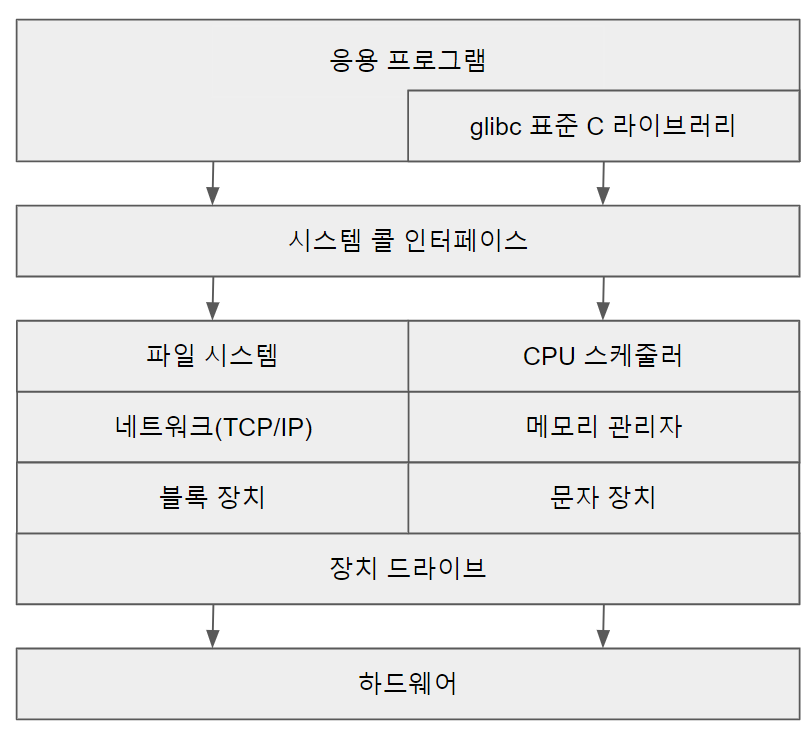

# **OperatingSystem** 💿

### 참고자료

- Operating System Concepts 10E

## 목차
>- Part1.개관
>>- [개요](#개요)
>>>- [운영체제가 할일](#운영체제가-할일)
>>>- [컴퓨터 시스템의 구성](#컴퓨터-시스템의-구성)
>>>- [컴퓨터 시스템 구조](#컴퓨터-시스템-구조)
>>>- [운영체제의 작동](#운영체제의-작동)
>>>- [자원 관리](#자원-관리)
>>- [운영체제 구조](#운영체제-구조)
>>>- [운영체제 서비스](#운영체제-서비스)
>>>- [사용자와 운영체제 인터페이스](#사용자와-운영체제-인터페이스)
>>>- [시스템 콜](#시스템-콜)
>>>- [링커와 로더](#링커와-로더)
>>>- [운영체제의 구조](#운영체제의-구조)
>- Part2.프로세스 관리
>>- [프로세스](#프로세스)
>>>- [프로세스 개념](#프로세스-개념)
>>>- [프로세스 스케줄링](#프로세스-스케줄링)
>>>- [프로세스에 대한 연산](#프로세스에-대한-연산)
>>>- [프로세스 간 통신](#프로세스-간-통신)
>>>- [IPC 시스템](#ipc-시스템)
>>- [스레드와 병행성](#스레드와-병행성)
>>>- [스레드 개요](#스레드-개요)
>>>- [다중 코어 프로그래밍](#다중-코어-프로그래밍)
>>>- [다중 스레드 모델](#다중-스레드-모델)
>>>- [스레드 라이브러리](#스레드-라이브러리)
>>>- [암묵적 스레딩](#암묵적-스레딩)
>>>- [스레드와 관련된 문제들](#스레드와-관련된-문제들)
>>>- [운영체제 사례](#운영체제-사례)
>>- [CPU 스케줄링](#cpu-스케줄링)
>>>- [기본 개념](#기본-개념)
>>>- [스케줄링 기준](#스케줄링-기준)
>>>- [스케줄링 알고리즘](#스케줄링-알고리즘)
>>>- [다중 처리기 스케줄링](#다중-처리기-스케줄링)
>>>- [실시간 CPU 스케줄링](#실시간-cpu-스케줄링)
>- Part3.프로세스 동기화
>>- [동기화 도구들](#동기화-도구들)
>>>- [동기화 도구들의 도입 배경](#동기화-도구들의-도입-배경)
>>>- [임계구역 문제](#임계구역-문제)
>>>- [Peterson의 해결안](#peterson의-해결안)
>>>- [동기화를 위한 하드웨어 지원](#동기화를-위한-하드웨어-지원)
>>>- [Mutex Locks](#mutex-locks)
>>>- [세마포 (Semaphores)](#세마포-semaphores)


<br>

---

## 개요

>### 운영체제가 할일
>- 컴퓨터 하드웨어를 관리하는 소프트웨어로 응용 프로그램을 위한 기반을 제공하며 컴퓨터 사용자와 컴퓨터 하드웨어 사이에서 중재자 역할
>- 운영체제의 역할을 이해하려면 컴퓨터 하드웨어 구성과 구조의 이해가 필요
>>- 운영체제의 근본적인 책임은 CPU, 메모리 및 입출력 장치와 저장장치와 같은 자원들을 프로그램에 적절히 할당하는 것
>>>- 자원 할당자라고 볼 수 있음
>>>- 컴퓨터의 부적절한 사용을 방지하기 위해 사용자 프로그램의 수행을 제어하고 특히 입출력 장치의 제어와 작동에 깊이 관여함
>- 운영체제의 구성
>>- 커널
>>>- 컴퓨터에서 항상 실행되는 프로그램
>>- 시스템 프로그램
>>>- 운영체제와 관련되어 시스템을 관리하는 데 도움이 되는 프로그램
>>- 미들웨어 프레임워크
>>>- 응용 프로그램 개발을 쉽게하도록 도와주는 기능을 제공하는 프로그램

<br>

[목차로 이동](#목차)

>### 컴퓨터 시스템의 구성
> 하나 이상의 CPU, 구성요소와 공유 메모리 사이의 엑세스를 제공하는 공통 버스를 통해 연결된 여러 장치 컨트롤러로 구성됨
>- 장치 컨트롤러
>>- 일부 로컬 버퍼 저장소와 특수 목적 레지스터 집합을 유지 관리함
>>- 제어하는 주변 장치와 로컬 버퍼 저장소 간 데이터를 이동함
>>- 일반적으로 운영체제에는 각 장치 컨트롤러마다 장치 드라이버가 있음
>>- CPU와 장치 컨트롤러는 병렬로 실행되어 메모리 사이클을 놓고 경쟁함
>>- 공유 메모리를 질서 있게 엑세스하기 위해 메모리 컨트롤러는 메모리에 대한 액세스를 동기화함
>- 인터럽트
>>- CPU의 조치가 필요한 이벤트에 대해 경고
>>- 컨트롤러는 장치 드라이버에게 작업을 완료했다는 사실을 인터럽트를 통해 알림
>>- 이외 많은 목적으로 사용되며 운영체제와 하드웨어의 상호 작용 방식의 핵심 부분임
>>- 긴급한 작업을 먼저 수행하기 위해 인터럽트 우선순위 시스템을 사용함
>- 저장장치
>>- CPU는 메모리에서만 명령을 적재할 수 있음
>>>- 실행하려면 프로그램을 메모리에 적재해야 함
>>>- 범용 컴퓨터는 프로그램 대부분을 재기록 가능한 메인 메모리(RAM)에서 가져옴
>>>>- 메인 메모리는 DRAM 이라 불리는 반도체 기술로 만들어짐
>>- 모든 형태의 메모리는 바이트의 배열을 제공함
>>>- 각 바이트는 자신의 주소를 가지고 있음
>>>- 상호 작용은 특정 메모리 주소들에 대한 일련의 적재(load), 또는 저장(store)명령을 통해 이루어짐
>>- 폰 노이만 구조 시스템의 명령-실행 사이클
>>>1. 메모리로부터 명령을 인출하여 명령 레지스터(instuction register)에 저장
>>>2. 명령을 해독
>>>>- 메모리로부터 피연산자를 인출하여 내부 레지스터에 저장하도록 유발할 수 있음
>>>>- 피연산자에 대한 명령을 실행한 후의 결과가 다시 메모리에 저장될 수 있음
>>- 대부분의 컴퓨터 시스템은 메인 메모리의 확장으로 보조저장장치를 제공
>>>- 보조저장장치는 대량의 데이터를 영구히 보존할 수 있어야 함
>- 입출력구조
>>- 운영체제 코드의 상당 부분은 시스템의 안정성과 성능에 대한 중요성과 장치의 다양한 특성으로 인해 I/O 관리에 할애됨

<br>

[목차로 이동](#목차)

>### 컴퓨터 시스템 구조
>- 단일 처리기 시스템
>>- 코어
>>>- 명령을 실행하고 로컬로 데이터를 저장하기 위한 레지스터를 포함하는 구성요소
>>>- 코어를 가진 하나의 메인 CPU는 프로세스의 명령어를 포함한 범용 명령어 세트를 실행할 수 있음
>>- 단일 처리 코어를 가진 범용 CPU가 하나만 있는 경우 단일 프로세서 시스템임
>- 프로세서와 프로세스
>>- 프로세서: 컴퓨터 내에서 프로그램을 수행하는 하드웨어 유닛으로써 CPU를 뜻하고, 폰노이만 아키텍처에 의해 만들어 졌다면 적어도 하나 이상의 ALU와 처리 레지스터를 내장함
>>- 프로세스: 메모리에 적재되어 프로세서에 의해 실행중인 프로그램
>- 다중 처리기 시스템
>>- 단일 코어 CPU가 두 개 이상의 프로세서가 있는 시스템
>>- 주요 장점으로 처리량 증가
>>>- 프로세서 수를 늘리면 더 적은 시간에 더 많은 작업을 수행
>>>- BUT, 여러 프로세서가 하나의 작업에 협력할 때 모든 프로세서가 올바르게 작동하기위한 일정 양의 오버헤드 발생
>>>- 오버헤드와 공유 자원에 대한 경합은 추가 프로세서의 예상 이득을 낮춤
>- 클러스터형 시스템
>>- 저장장치를 공유하고 근거리 통신망(LAN)이나 InfiniBand와 같은 고속의 상호 연결망으로 연결됨
>>- 높은 가용성을 제공함

<br>

[목차로 이동](#목차)

>### 운영체제의 작동
>- 작동 전반
>>1. 정원을 켜거나 재부팅 할 때와 같이 컴퓨터를 실행하려면 부트스트랩 프로그램을 실행해야 함
>>>- 단순한 형태를 띄는 경향이 있고, 일반적으로 컴퓨터 하드웨어 내에 펌웨어로 저장됨
>>2. CPU 레지스터에서 장치 컨트롤러, 메모리 내용에 이르기까지 시스템의 모든 측면을 초기화함
>>3. 부트스트랩 프로그램이 운영체제 커널을 찾아 메모리에 적재
>>4. 커널이 적재되어 실행되면 시스템과 사용자에게 서비스를 제공할 수 있음
>>5. 실행할 프로세스, 서비스할 I/O 장치 및 응답할 사용자가 없는 경우 대기하다가 인터럽트에 의해 이벤트가 발생됨
>- 다중 프로그래밍과 다중 태스킹
>>- 다중 프로그래밍
>>>- CPU가 항상 한 개는 실행할 수 있도록 프로그램을 구성하여 CPU 이용률을 높이고 사용자 만족도를 높임
>>>- 다중 프로그램 시스템에서 실행 중인 프로그램을 프로세스라 함
>>>- 운영체제는 동시에 여러 프로세스를 메모리에 유지함
>>- 다중 태스킹
>>>- 다중 프로그래밍의 논리적 확장으로 CPU를 여러 프로세스를 전환해가며 프로세스를 실행
>>>- 전환이 자주 발생하여 사용자에게 빠른 응답 시간을 제공할 수 있음
>>>- CPU 스케줄링으로 실행할 프로세스가 정해지며 여러 프로세스를 병행하게 실행하려면 운영체제의 모든 단계에서 서로 영향을 미치는 기능이 제한되어야 함
>>>- 다중 태스킹 시스템에서 운영체제는 적절한 응답 시간을 보장해야함
>- 이중 모드와 다중 모드 운용
>>- 시스템을 올바르게 실행하려면 운영체제 코드 실행과 사용자 정의 코드 실행을 구분해야함
>>>- 대부분의 컴퓨터 시스템이 다양한 실행 모드를 차별화 할 수 있는 하드웨어지원을 제공함
>>>- 적어도 사용자 모드와 커널 모드(수퍼바이저 모드, 시스템 모드, 혹은 특권 모드)를 필요로 함

<br>

[목차로 이동](#목차)

>### 자원 관리
>- 시스템의 CPU, 메모리 공간, 파일 저장 공간 및 I/O 장치는 운영체제가 관리해야 하는 자원임
>- 프로세스 관리
>>- 프로세스는 자기 일을 수행하기 위해 CPU 시간, 메모리, 파일, 그리고 입출력 장치를 포함한 여러 가지 자원을 필요로 하고 실행되는 동안 할당됨
>>- 하나의 프로그램은 디스크에 저장된 파일의 내용과 같이 수독적 개체지만 프로세스는 다음 수행할 명령을 지정하는 Program Counter를 가진 능동적 개체임
>>- 다중 스레드 프로세스는 여러 개의 프로그램 카운터를 가지고 있으며 이 카운터들은 각 스레드가 실행할 다음 명령어를 가리킴
>>- 한 프로세스는 한 시스템 내의 작업의 단위이며 시스템은 프로세스의 집합으로 구성됨
>>- 운영체제의 프로세스 관리 책임
>>>- 사용자 프로세스와 시스템 프로세스의 생성과 제거
>>>- CPU에 프로세스와 스레드 스케줄
>>>- 프로세스의 일시 중지와 재수행
>>>- 프로세스 동기화를 위한 기법 제공
>>>- 프로세스 통신을 위한 기법 제공
>- 메모리 관리
>>- 운영체제의 메모리 관리 책임
>>>- 메모리의 어느 부분이 현재 사용되고 있으며 어느 프로세스에 의해 사용되고 있는지 추적
>>>- 필요에 따라 메모리 공간을 할당 및 회수
>>>- 어떤 프로세스를 메모리에 적재하고 제거할 것인지 결정
>- 파일 시스템 관리
>>- 운영체제는 저장장치의 물리적 특성을 추상화하여 논리적인 저장 단위인 파일을 정의
>>- 운영체제는 파일을 물리적 매개로 매핑하며, 저장장치를 통해 이 파일들에 접근
>>- 파일은 통상 디렉터리들로 구성됨
>>- 운영체제의 파일 관리 책임
>>>- 파일의 생성 및 제거
>>>- 디렉터리 생성 및 제거
>>>- 파일과 디렉터리를 조작하기 위한 프리미티브 제공
>>>- 파일을 보조저장장치로 매핑
>>>- 안정적인(비휘발성) 저장 매체에 파일을 백업
>- 대용량 저장장치 관리
>>- 운영체제의 보조저장장치 관리 책임
>>>- 마운팅과 언마운팅
>>>- 사용 가능 공간의 관리
>>>- 저장장소 할당
>>>- 디스크 스케줄링
>>>- 저장장치 분할
>>>- 보호

<br>

[목차로 이동](#목차)

---

## 운영체제 구조

>### 운영체제 서비스
>- 프로그램 실행 환경을 제공하는 운영체제는 프로그램과 그 프로그램의 사용자에게 특정 서비스를 제공함
>>- 운영체제마다 제공하는 서비스는 다르지만 공통적인 서비스가 존재함
>- 프로그래밍 작업을 위해 제공하는 서비스의 종류
>>- 사용자 인터페이스
>>>- 거의 모든 운영체제는 사용자 인터페이스(UI)를 제공함
>>>- GUI (그래픽 사용자 인터페이스) / CLI (명령어 라인 인터페이스) 로 나뉨
>>- 프로그램 수행
>>>- 프로그램을 메모리에 적재해 실행할 수 있어야 하며 정상적이든 비정상적이든(오류를 표시하며) 실행을 끝낼 수 있어야 함
>>- 입출력 연산
>>>- 수행 중인 프로그램은 입출력을 요구할 수 있으며 파일 혹은 입출력 장치가 연관됨
>>>- 효율과 보호를 위해 사용자들은 통상적으로 입출력 장치를 직접 제어할 수 없고, 운영체제가 입출력 수행의 수단을 제공해야 함
>>- 파일 시스템 조작
>>>- 프로그램은 파일을 읽고 쓸 필요가 있으며 이름에 의해 파일을 생성하고 삭제할 수 있고 지정된 파일을 찾을 수 있어야 하고 파일의 정보를 열거할 수 있어야 함
>>>- 운영체제는 개인의 선택에 따라 또는 특정 특성과 특정 성능을 제공하기 위해 다양한 파일 시스템을 제공함
>>- 통신
>>>- 서로 다른 프로세스가 정보를 교환해야 할 필요가 있음
>>>- 동일 컴퓨터의 프로세스간 통신, 네트워크를 통해 연결된 서로 다른 컴퓨터 시스템에서 수행되는 프로세스간 통신으로 나뉨
>>>- 통신 구현 방법으로 공유 메모리, 메시지 전달 기법이 존재
>>>>- 메시지 전달 기법에는 정보의 패킷들이 운영체제에 의해 프로세스 사이를 이동
>>- 오류 탐지
>>>- 운영체제는 발생할 수 있는 모든 오류를 의식하고 있어야 함
>>>- CPU, 메모리 하드웨어(메모리 오류, 정전 등), 입출력 장치(테이프의 패리티 오류, 네트워크 접속 실패, 프린터의 종이 부족 등), 사용자 프로그램(연산 오버플로, 불법적 메모리 접근 시도) 등에서 오류가 발생할 수 있음
>- 시스템 자체의 효율적인 동작을 보장하기 위한 운영체제 기능
>>- 다수의 프로세스가 사용하는 시스템에서는 프로세스 간 자원을 공유하게 하여 효율성을 얻을 수 있음
>>- 자원 할당
>>>- 운영체제는 여러 종류의 자원을 관리하며 다수의 프로세스나 다수의 작업이 동시에 진행될 때 각각에 자원을 할당해줘야 함
>>- 기록작성
>>>- 어떤 프로그램이 어떤 종류의 자원을 얼마나 많이 사용하는지 추적할 수 있음
>>>- 기록 관리는 회계(사용자에게 청구서를 보낼 수 있도록), 단순한 사용 통계를 내기 위해 사용됨
>>- 보호와 보안
>>>- 보호는 여러 프로세스가 병행중인 상황에서 특정 프로세스가 다른 프로세스나 운영체제 자체를 방해하지 않도록 시스템 자원에 대한 모든 접근이 통제되도록 보장하는 것을 필요로 함
>>>- 보안은 네트워크 어댑터 등과 같은 외부 입출력 장치들을 부적합한 접근 시도로부터 지키고, 침입의 탐지를 위해 모든 접속을 기록하는 것까지 포함

<br>

[목차로 이동](#목차)

>### 사용자와 운영체제 인터페이스
>- 명령 인터프리터
>>- 운영체제 대부분은 명령 인터프리터를 프로세스가 시작되거나 사용자가 처음 로그온할 때 수행되는 특수한 프로그램으로 취급함
>>- 선택할 수 있는 여러 명령 인터프리터를 제공하는 시스템에서 이 해석기는 셸(shell)이라고 부르며 대부분의 셸은 유사한 기능을 제공함
>>>- 사용자가 지정한 명령을 가져와서 수행하는 것이 주요 기능임
>>>- 제공되는 명령들은 파일을 생성, 삭제, 리스트, 프린트, 복사, 수행 등을 수행함
>>- 명령어들은 두 가지 일반적인 방식으로 구현됨
>>>- 명령 인터프리터 자체가 명령을 실행할 코드를 가지는 경우
>>>- 시스템 프로그램에 의해 대부분의 명령을 구현하는 경우
>>>>- 명령 인터프리터가 명령에 대해 알지 못하며 단순히 메모리에 적재되어 실행될 파일을 식별하기 위해 명령을 사용함
>>>>- 이러한 경우 명령 인터프리터 프로그램이 아주 작아질 수 있으며, 새로운 명령을 추가하기 위해 변경될 필요가 없음
>- 그래픽 기반 사용자 인터페이스
>>- 사용자 친화적인 그래픽 기반 사용자 인터페이스 또는 GUI를 통하는 방식
>>- 데스크톱이라 불리며 마우스를 기반으로하는 윈도우 메뉴 시스템을 이용함
>- 인터페이스의 선택
>>- 컴퓨터를 관리하는 시스템 관리자와 시스템에 대해 깊게 알고 있는 파워유저들은 명령어 라인 인터페이스를 주로 사용함
>>>- 하고자 하는 작업에 더 빨리 접근할 수 있고 GUI에서 사용할 수 없는 기능들을 사용할 수 있음
>>>- 반복적으로 해야하는 작업을 셸 스크립트로 프로그래밍하여 쉽게 할 수 있음
>>- 유용하고 친밀한 사용자 인터페이스를 설계하는 것이 운영체제의 직접적인 기능은 아님

<br>

[목차로 이동](#목차)

>### 시스템 콜
>- 프로세스가 운영체제의 커널이 제공하는 서비스를 요청할 때 사용하는 방법으로 운영체제에 의해 사용 가능하게 된 서비스에 대한 인터페이스를 제공함
>- 시스템 콜의 유형
>>- 프로세스 제어 (Process Control)
>>- 파일 조작 (File Manipulation)
>>- 장치 조작 (Device Management)
>>- 정보 유지 보수 (Information Maintenance)
>>- 통신 (Communication)
>>- 보호 (Protection)

<br>

[목차로 이동](#목차)

>### 링커와 로더
>- 일반적으로 프로그램은 디스크에 이진 실행 파일로 존재하며 CPU에서 실행하려면 메모리로 가져와 프로세스 형태로 배치되어야 함
>- 프로그램을 컴파일하고 메모리에 배치하여 사용 가능한 CPU 코어에서 실행됨
>>1. 소스 파일은 임의의 물리 메모리 위치에 적재되도록 설계된 오브젝트 파일로 컴파일되며 재배치 가능 오브젝트 파일이라고 함
>>2. 링커가 재배치 가능 오브젝트 파일을 하나의 이진 파일로 결합함
>>3. 로더가 이진 실행 파일을 메모리에 적재하며 CPU 코어에서 실행할 수 있는 상태가 됨

<br>

[목차로 이동](#목차)

>### 운영체제의 구조
>- 현재의 운영체제 같이 크고 복잡한 시스템은 적절하게 동작하고 쉽게 변경될 수 있어야 함
>>- 일반적으로 한 개의 일관된 시스템보다는 태스크를 작은 구성요소로 분할함
>>- 구성요소 각각은 신중히 정의된 인터페이스와 기능들을 가진 시스템의 잘 정의된 부분이어야 함
>- 모놀리식 구조
>>- 운영체제를 구성하는 가장 간단한 구조는 모놀리식 구조라고 불리는 커널의 모든 기능을 단일 주소 공간에서 실행되는 단일 정적 이진 파일에 넣는것으로 운영체제를 설계하는 일반적인 기술임
>>- 제한적인 구조를 가진 운영체제의 예는 최초의 UNIX 운영체제로 커널과 시스템 프로그램의 두 부분으로 구성됨
>>>- 
>>>- 커널은 여러 가지 인터페이스와 장치 드라이버로 다시 분리되는데 UNIX가 발전해오면서 추가되고 확장된 것임
>>>- 시스템 콜 인터페이스 아래와 물리적 하드웨어 위의 모든 것이 커널임
>>>>- 커널은 시스템 콜을 통해 파일 시스템, CPU 스케줄링, 메모리 관리 그리고 다른 운영체제 기능을 제공함
>>- Linux는 UNIX에 기반을 두고 있으며 Linux 커널은 단일 주소 공간에서 커널 모드로 전부 실행된다는 점에서 모놀리식이지만 런타임 중에 커널을 수정할 수 있는 모듈식 설계를 갖추고 있음
>>>- 
>>- 모놀리식 커널은 명백한 단순성에도 불구하고 구현 및 확장하기 어렵지만 모놀리식 커널은 성능 면에서 뚜렷한 이점이 있음
>>>- 시스템 콜 인터페이스에는 오버헤드가 거의 없고 커널 안에서의 통신 속도가 빠름
>>>- 모놀리식 커널의 단점에도 불구하고 속도와 효율성은 이 구조를 여전히 UNIX, Linux 및 Windows 운영체제에서 발견할 수 있는 이유임
>- 계층적 접근
>>- 모놀리식 접근법은 시스템의 한 부분을 변경하면 다른 부분에 광범위한 영향을 줄 수 있어 밀접하게 결합된 시스템으로 불림
>>- 대안으로 느슨하게 결합된 시스템을 설계할 수 있음
>>>- 특정 기능 및 한정된 기능을 가진 개별적 작은 구성요소로 나누고 모든 구성요소가 합쳐지면 커널이 구성됨
>>>- 한 구성요소의 변경이 다른 구성요소에는 영향을 미치지 않으므로 시스템 구현자가 시스템의 내부 작동을 더 자유롭게 생성하고 변경할 수 있음
>>- 시스템은 다양한 방식으로 모듈화 될 수 있으며 그 중 한 가지 방식이 계층적 접근방식임
>>>- 최하위 층(0층)은 하드웨어이고 최상위 층(N층)은 사용자 인터페이스임
>>>- 운영체제 층은 데이터와 이를 조작하는 연산으로 구성된 추상 객체의 구현임
>>>>- 전형적인 운영체제 층(M층)은 자료구조와 상위층에서 호출할 수 있는 루틴의 집합으로 구성됨
>>>>- M층은 하위 층에 대한 연산을 호출할 수 있음
>>- 계층적 접근 방식은 구현과 디버깅이 간단하다는 장점이 있음
>>>- 각 층은 단지 자신보다 하위 층들의 서비스와 기능(연산)들만 사용하여 시스템의 검증과 디버깅 작업을 단순화함
>>>>- 어느 층의 디버깅 중 오류가 발견되며 하위 층들은 이미 디버깅되었기 때문에 오류는 반드시 해당 층에 있음
>>>>- 시스템을 계층으로 나누면 시스템의 설계나 구현이 간단해짐
>>>- 각 층은 자신보다 하위 층에 의해 제공된 연산들만을 사용하여 구현되는데 연산들이 어떻게 구현되는지 알 필요가 없고 연산들이 무엇을 하는지만 알면 됨
>>>- 각 층은 특정 데이터 구조와 연산 그리고 하드웨어의 존재를 상위 층에 대해 숨길 수 있음
>>- 계층화된 시스템은 컴퓨터 네트워크(TCP/IP 등) 및 웹 응용 프로그램에서 성공적으로 사용되었으나 순수한 계층 접근 방식을 사용하는 운영체제는 많지 않음
>>>- 각 계층의 기능을 적절히 정의해야 하는데 문제가 있음
>>>- 시스템의 전반적인 성능은 운영체제 서비스를 얻기 위해 사용자 프로그램이 여러 계층을 통과해야 하는 오버헤드로 인해 열악함
>>- 어느 정도의 계층화는 현대 운영체제에서 공통적임
>>>- 더 많은 기능을 가진 더 적은 개수의 층을 가지므로 층 기능의 정의 및 상호작용의 문제를 피하면서 모듈화된 코드의 장점을 최대한 활용할 수 있음
>- 마이크로커널
>>- 중요하지 않은 구성요소를 커널로부터 제거하고 별도의 주소공간에 존재하는 사용자 수준 프로그램으로 구현하여 운영체제를 구성하는 방법
>>- 서비스의 대부분이 커널이 아닌 사용자 프로세스로 수행되기 때문에 더욱 높은 보안성과 신뢰성을 제공함
>- 모듈
>>- 적재가능 커널 모듈(loadable kernel modules, LKM)에서의 커널은 핵심적인 구성요소의 집합을 가지고 있고 부팅 또는 실행 중에 부가적인 서비스들을 모듈을 통하여 링크함
>>- 커널은 핵심 서비스를 제공하고 다른 서비스들은 커널이 실행되는 동안 동적으로 구현하는 것
>>- 전체적으로 커널의 각 부분이 정의되고 보호된 인터페이스를 가진다는 점에서 계층 구조를 닮았으나 모듈이 임의의 다른 모듈을 호출할 수 있다는 점에서 훨씬 유연함
>>- 중심 모듈은 핵심 기능만을 가지고 있고 다른 모듈의 적재방법과 모듈들과 통신방법을 안다는 점에서 마이크로 커널과 유사하지만 메시지 전달을 호출할 필요가 없기 때문에 더 효율적임
>- 하이브리드 시스템
>>- 하나의 구조로 만드는 운영체제는 거의 존재하지 않음
>>- 다양한 구조를 결합하여 성능, 보안, 편리성 문제를 해결하려는 혼용 구조로 구성됨

<br>

[목차로 이동](#목차)

---

## 프로세스

>### 프로세스 개념
>- 프로세스
>>- 프로세스란 실행 중인 프로그램
>>- 프로세스의 현재 활동 상태는 프로그램 카운터 값과 프로세서 레지스터의 내용으로 나타냄
>>- 프로세스의 메모리 배치
>>>- 텍스트 섹션 : 실행 코드
>>>- 데이터 섹션 : 전역 변수
>>>- 힙 섹션 : 프로그램 실행 중에 동적으로 할당되는 메모리
>>>- 스택 섹션 : 함수를 호출할 때 임시 데이터 저장장소 (함수 매개변수, 복귀 주소 및 지연 변수 등)
>>- 프로세스의 메모리
>>>- 텍스트 및 데이터 섹션의 크기는 고정
>>>- 스택 및 힙 섹션은 프로그램 실행 중에 동적으로 변경
>>>>- 함수가 호출될 때마다 함수 매개변수, 지역 변수 및 복귀 주소를 포함하는 활성화 레코드가 스택에 푸시되며 함수로부터 제어가 되돌아오면 활성화 레코드가 스택에서 팝
>>>>- 메모리가 동적으로 할당됨에 따라 힙이 커지고 메모리가 시스템에 반환되면 축소
>>>>- 운영체제는 스택 및 힙 섹션이 서로의 방향으로 커지더라도 서로 겹치지 않도록 해야함
>>- 프로그램과 프로세스
>>>- 프로그램 그 자체는 프로세스가 아님
>>>- 프로그램은 명령어 리스트를 내용으로 가진 디스크에 저장된 파일과 같은 수동적인 존재
>>>- 프로세스는 다음에 실행할 명령어를 지정하는 프로그램 카운터와 관련 자원의 집합을 가진 능동적인 존재
>>>- 실행 파일이 메모리에 적재될 때 프로그램은 프로세스가 됨
>- 프로세스 상태
>>- 프로세스는 실행되면서 현재의 활동에 따라 프로세스의 상태가 정의됨
>>>- new : 프로세스 생성 중
>>>- running : 명령어들이 실행 중
>>>- waiting : 프로세스가 어떤 이벤트(입출력 완료 또는 신호의 수신 등)가 일어나기를 기다림
>>>- ready : 프로세스가 처리기에 할당되기를 기다림
>>>- terminated : 프로세스의 실행이 종료
>- 프로세스 제어 블록
>>- 각 프로세스는 운영체제에서 프로세스 제어 블록(PCB, Process Control Block)에 의해 표현됨
>>- 프로세스 제어 블록은 특정 프로세스와 연관된 여러 정보를 수록
>>>- 프로세스 상태 : (new, ready, running, waiting, halted 등)
>>>- 프로그램 카운터 : 프로세스가 다음에 실행할 명령어의 주소를 저장
>>>- CPU 레지스터들
>>>>- 컴퓨터의 구조에 따라 다양한 수와 유형을 가짐
>>>>- 누산기(accumulator), 인덱스 레지스터, 스택 레지스터, 범용 레지스터, 상태 코드 정보가 포함됨
>>>>- PC와 함께 추후 프로세스가 다시 스케줄 될 때 계속 올바르게 실행되도록 하기 위해 인터럽트 발생 시 저장되어야 함
>>>- CPU-스케줄링 정보 : 프로세스의 우선순위, 스케줄 큐에 대한 포인터와 다른 스케줄 매개변수를 포함함
>>>- 메모리 관리 정보 : 운영체제에 의해 사용되는 메모리 시스템에 따라 기준 레지스터와 한계 레지스터의 값, 운영체제가 사용하는 메모리 시스템에 따라 페이지 테이블 또는 세그먼트 테이블 등과 같은 정보를 포함함
>>>- 회계(accounting) 정보 : CPU 사용 시간과 경과된 시간, 시간 제한, 계정 번호, 잡 또는 프로세스 번호 등을 포함함
>>>- 입출력 상태 정보 : 해당 프로세스에 할당된 입출력 장치들과 열린 파일의 목록 등을 포함함
>>- PCB는 약간의 회계 데이터와 함께 프로세스를 시작시키거나 다시 시작시키는 데 필요한 모든 데이터를 위한 저장소의 역할을 함
>- 스레드
>>- 현대 운영체제는 프로세스 개념을 확장하여 한 프로세스가 다수의 실행 스레드를 가질 수 있도록 허용함
>>- 프로세스는 다수의 실행 스레드를 통해 한 번에 하나 이상의 일을 수행할 수 있음

<br>

[목차로 이동](#목차)

>### 프로세스 스케줄링
>- 개요
>>- 다중 프로그래밍의 목적은 항상 어떤 프로세스가 실행되도록 하여 CPU 이용을 최대화 하는 것임
>>- 시분할의 목적은 각 프로그램이 실행되는 동안 사용자가 상호 작용할 수 있도록 프로세스들 사이에서 CPU 코어를 빈번하게 교체하는 것임
>>- 두 목적을 달성하기 위해 프로세스 스케줄러는 코어에서 실행 가능한 여러 프로세스 중에서 하나의 프로세스를 선택함
>>>- 각 CPU 코어는 한 번에 하나의 프로세스를 실행할 수 있음
>>>- 코어보다 많은 프로세스가 있는 경우 초과 프로세스는 코어가 사용 가능해지고 다시 스케줄 될 때까지 대기해야함
>>>>- 현재 메모리에 있는 프로세스 수를 다중 프로그래밍 정도라고 함
>>- 다중 프로그래밍 및 시간 공유의 목표를 균형 있게 유지하려면 프로세스의 일반적인 동작을 고려해야 함
>>>- 대부분 프로세스는 I/O 바운드 또는 CPU 바운드로 설명됨
>>>>- I/O 바운드 프로세스 : 계산에 소비하는 것보다 I/O에 더 많은 시간을 소비하는 프로세스
>>>>- CPU 바운드 프로세스 : 계산에 더 많은 시간을 사용하여 I/O 요청을 자주 생성하지 않는 프로세스
>- 스케줄링 큐
>>- 프로세스가 시스템에 들어가면 준비 큐에 들어가서 준비 상태가 되고 CPU 코어에서 실행되기를 기다림
>>>- 준비 큐 헤더에는 리스트의 첫 번째 PCB에 대한 포인터가 저장되고 각 PCB에는 준비 큐의 다음 PCB를 가리키는 포인터 필드가 포함됨
>>- 프로세스에 CPU 코어가 할당되면 프로세스는 잠시 동안 실행되어 결국 종료되거나 인터럽트 되거나 I/O 요청의 완료와 같은 특정 이벤트가 발생할 때까지 기다리는데, 특정 이벤트가 발생하기를 기다리는 프로세스는 대기 큐에 삽입됨
>>- 새 프로세스는 준비 큐에 놓이고, 실행을 위해 선택되거나 디스패치 될 때까지 기다리다가 프로세스에 CPU 코어가 할당되고 실행 상태가 되면 여러 이벤트 중 하나가 발생할 수 있음
>>>- 프로세스가 I/O 요청을 공표한 다음 I/O 대기 큐에 놓일 수 있음
>>>- 프로세스는 새 자식 프로세스를 만든 다음 자식의 종료를 기다리는 동안 대기 큐에 놓일 수 있음
>>>- 인터럽트 또는 타임 슬라이스가 만료되어 프로세스가 코어에서 강제로 제거되어 준비 큐로 돌아갈 수 있음
>>- 프로세스는 종료될 때 까지 대기 상태에서 준비 상태로 전환된 다음 준비 큐에 다시 들어가는 주기를 계속하다가 종료 시점에 모든 큐에서 제거되고 PCB 및 자원이 반환됨
>- CPU 스케줄링
>>- CPU의 스케줄러의 역할은 준비 큐에 있는 프로세스 중에서 선택된 하나의 프로세스에 CPU 코어를 할당하는 것
>>- 일부 운영체제는 스와핑으로 알려진 중간 형태의 스케줄링을 가지고 있음
>>>- 스와핑 스케줄링 : 프로세스를 메모리에서 디스크로 swap-out하여 현재 상태를 저장하고, 이후 디스크에서 메모리로 swap-in하여 상태를 복원하는 기법
>>>- 메모리 및 CPU에 대한 능동적 경쟁에서 프로세스를 제거하여 다중 프로그래밍의 정도를 감소시킴
>- 문맥 교환
>>- CPU 코어를 다른 프로세스로 교환할때 이전의 프로세스 상태를 보관하고 새로운 프로세스의 보관된 상태를 복구하는 작업
>>- CPU의 현재 상태를 저장하는 작업을 수행하고 (state save), 추후 연산을 재개하기 위하여 상태 복구 작업을 수행함 (state restore)
>>- 문맥은 프로세스의 PCB에 표현되며 CPU 레지스터의 값, 프로세스 상태, 메모리 관리 정보 등을 포함

<br>

[목차로 이동](#목차)

>### 프로세스에 대한 연산
>- 프로세스 생성
>>- 프로세스는 실행되는 동안 여러 새로운 프로세스를 생성할 수 있음
>>>- 생성하는 프로세스를 부모 프로세스, 새로운 프로세스는 자식 프로세스라 부름
>>>- 새로운 프로세스들은 각각 새로운 프로세스들을 생성할 수 있으며 그 결과 프로세스 트리를 형성함
>>- 대부분의 현대 운영체제들은 정수로 표현되는 유일한 프로세스 식별자(pid)를 사용하여 프로세스를 구분함
>>>- pid는 커널이 유지하고 있는 프로세스의 다양한 속성에 접근하는 index로 사용됨
>>>- 시스템이 부트될 때 생성되는 첫 번째 사용자 프로세스로 pid가 1인 프로세스가 있으며 모든 사용자 프로세스의 루트 부모 프로세스 역할을 함
>>>>- Linux의 경우 systemd
>>>>- 시스템이 부팅되면 systemd 프로세스는 다양한 사용자 프로세스를 생성함
>>- 프로세스가 자식 프로세스를 생성할 때 자식 프로세스는 자신의 임무를 달성하기 위해 자원이 필요함
>>>- 자식 프로세스는 자원을 운영체제로부터 직접 얻거나 부모 프로세스의 자원의 일부를 사용하도록 제한될 수 있음
>>>- 부모 프로세스는 자원을 분할하여 자식 프로세스들에게 나누어 주거나 메모리나 파일과 같은 몇몇 자원들은 자식 프로세스들이 같이 사용하게 할 수 있음
>>>- 프로세스가 새로운 프로세스를 생성 후 실행되는 방법
>>>>- 부모와 자식이 병행하게 실행됨
>>>>- 부모가 일부 또는 모든 자식이 실행을 종료할 때까지 기다림
>>>- 새로운 프로세스들의 주소 공간 측면에서 볼 때의 두 가지 가능성
>>>>- 자식 프로세스는 부모 프로세스의 복사본
>>>>- 자식 프로세스가 자식에게 적재될 새로운 프로그램을 가지고 있음
>- 프로세스 종료
>>- 프로세스가 마지막 문장의 실행을 끝내고 exit 시스템 콜을 사용하여 운영체제에 자신의 삭제를 요청하면 종료됨
>>>- 해당 시점에 프로세스는 자신을 기다리고 있는 부모 프로세스에 (wait 시스템 콜을 통해) 상태 값 (정수값)을 반환할 수 있음
>>>- 종료될 때 물리 메모리와 가상 메모리, 열린 파일, 입출력 버퍼를 포함한 프로세스의 모든 자원이 할당 해제되고 운영체제로 반납됨
>>- 부모가 자식을 종료시키기 위해선 자식의 pid를 알아야 함
>>>- 한 프로세스가 새로운 프로세스를 만들 때 새로 만들어진 프로세스의 신원이 부모에게 전달됨
>>>- 부모가 자식의 실행을 종료하는 이유
>>>>- 자식이 자신에게 할당된 자원을 초과하여 사용할 때, 이때 부모가 자식들의 상태를 검사할 수 있는 방법이 존재해야 함
>>>>- 자식에게 할당된 태스크가 더 이상 필요 없을 때
>>>>- 운영체제가 부모가 exit 한 후 자식이 실행을 계속하는 것을 허용하지 않는 경우
>>- 부모 프로세스는 wait() 시스템 콜을 사용해서 자식 프로세스가 종료할 때를 기다릴 수 있음
>>>- wati() 시스템 콜은 부모가 자식의 종료 상태를 얻어낼 수 있도록 하나의 인자를 전달받음
>>>- wati() 시스템 콜은 부모가 어느 자식이 종료되었는지 구별할 수 있도록 종료된 자식의 프로세스 식별자를 반환함
>>>>```
>>>>pid_t = pid;
>>>>int status;
>>>>
>>>>pid = wait(&status);
>>>>```
>>>- 프로세스가 종료하면 사용하던 자원은 운영체제가 되찾아 가지만 프로세스의 종료 상태가 저장되는 프로세스 테이블의 해당 항목은 부모 프로세스가 wait()를 호출할 때까지 남아 있음
>>>- 종료되었지만 부모 프로세스가 wait() 호출을 하지 않은 프로세스를 좀비 프로세스라고 함
>>>>- 종료하게 되면 모든 프로세스는 아주 짧은 시간동안 좀비 상태가 됨
>>>>- 부모가 wait() 를 호출하면 좀비 프로세스의 프로세스 식별자와 프로세스 테이블의 해당 항목이 운영체제에 반환됨
>>>- 부모 프로세스가 wait()를 호출하는 대신 종료하면 자식 프로세스는 고아(orphan) 프로세스라고 부름
>>>>- UNIX, Linux는 고아 프로세스의 새로운 부모 프로세스로 init 프로세스를 지정하여 문제를 해결함
>>>>- init 프로세스는 주기적으로 wait() 를 호출하여 고아 프로세스의 종료 상태를 수집하고 프로세스 식별자와 프로세스 테이블 항목을 반환함

<br>

[목차로 이동](#목차)

>### 프로세스 간 통신
>- 운영체제 내에서 실행되는 병행 프로세스들은 독립적이거나 협력적인 프로세스임
>>- 독립적 프로세스 : 시스템에서 실행 중인 다른 프로세스들과 데이터를 공유하지 않는 프로세스
>>- 협력적 프로세스 : 시스템에서 실행 중인 다른 프로세스들에 영향을 주거나 받는 프로세스
>>- 프로세스 협력을 허용하는 환경을 제공하는 이유
>>>- 정보 공유 : 여러 응용 프로그램이 동일한 정보 (복사 붙여넣기 등) 를 병행적으로 접근할 수 있도록 환경을 제공해야 함
>>>- 계산 가속화 : 특정 태스크를 빨리 처리하고자 할때, 서브태스크로 나누어 병렬로 처리하도록 해야함
>>>- 모듈성 : 시스템 기능을 별도의 프로세스들 또는 스레드들로 나누어 모듈식 형태로 시스템을 구성하기를 원할 수 있음
>- 협력적 프로세스들은 서로 데이터를 공유할 수 있도록 프로세스 간 통신(IPC, interprocess communication) 기법이 필요
>>- 프로세스 간 통신에는 기본적으로 공유 메모리와 메시지 전달 모델이 있음
>>- 많은 시스템이 두 모델을 모두 구현함
>>- 공유 메모리 모델
>>>- 협력 프로세스들에 의해 공유되는 메모리의 영역이 구축되고 해당 영역에서 정보를 교환함
>>>- 공유 메모리 영역을 구축할 때만 시스템 콜이 필요하고 일단 구축이 되면 모든 접근은 일반적인 메모리 접근으로 취급되어 커널의 도움이 필요없고 빠름
>>- 메시지 전달 모델
>>>- 협력 프로세스들 사이에 교환되는 메시지를 통하여 통신이 이루어짐
>>>- 충돌을 회피할 필요가 없기 때문에 적은 양의 데이터를 교환하는데 유용하며 분산 시스템에서 공유 메모리보다 구현하기 쉬움
>>>- 통상 시스템 콜을 이용하여 구현되므로 커널 간섭 등의 부가적인 시간 소비 작업이 필요하기 때문에 공유 메모리 모델보다 느림

<br>

[목차로 이동](#목차)

>### IPC 시스템
>- POSIX 공유 메모리
>>- 메모리 사상 (Memory-Mapping) 파일을 사용하여 구현되며 공유 메모리의 특정 영역을 파일과 연관시킴
>>- 생산자는 공유 메모리 객체를 구축하고 공유 메모리에 데이터를 쓰고 소비자는 공유 메모리에서 데이터를 읽음
>- Mach 메시지 전달
>>- Mach 커널은 프로세스와 유사하지만 제어 스레드가 많고 관련 자원이 적은 다중 태스크의 생성 및 제거를 지원함
>>- 대부분의 통신은 메시지로 수행되며 크기가 정해져 있고 단방향인 포트라고 하는 메일박스로 메시지를 주고 받음
>>- 포트를 사용하여 태스크, 스레드, 메모리 및 프로세서와 같은 자원을 나타내며 메시지 전달은 시스템 자원 및 서비스와 상호 작용하기 위한 객체 지향 접근 방식을 제공함
>>- Mach 메시지에 포함된 필드
>>>- 고정 크기의 메시지 헤더 ( 메시지 크기, 소스 및 대상 포트를 포함한 메시지에 관한 메타 데이터를 포함함 )
>>>- 데이터를 포함하는 가변 크기 본체
>>- 포트의 큐가 가득찬 경우
>>>1. 큐에 공간이 생길때까지 계속 기다림
>>>2. 최대 n 밀리초 동안 대기
>>>3. 기다리지 않고 즉시 복귀
>>>4. 메시지를 일시적으로 캐시하고 운영체제에 전달하여 보존하고 큐에 넣을 수 있을 때 통지 메시지가 송신자에게 전송됨, 송신 스레드마다 하나의 메시지만 커널에 보관할 수 있음
>- Windows
>>- 다중 운영 환경 또는 서브시스템을 지원하며 응용 프로그램은 메시지 전달 기법을 통해 서로 통신함
>>- ALPC ( 고급 로컬 프로시저 호출 설비, advanced local procedure call facility)
>>>- 동일 기계상에 있는 두 프로세스간 통신에 사용됨
>>>- 표준 원격 프로시저 호출 ( RPC ) 기법과 같으나 Windows에 맞게 최적화됨
>>>- 연결 포트 ( connection port ) 와 통신 포트 ( communication port ) 두 가지 유형의 포트를 사용함
>>- ALPC 채널이 생성되면 선택되는 메시지 전달 기법
>>>1. 256바이트 미만의 작은 메시지의 경우 포트의 메시지 큐가 중간 저장소로 사용되고, 메시지는 프로세스에서 프로세스로 복사됨
>>>2. 대용량 메시지는 섹션 객체를 통하여 전달됨
>>>>- 섹션 객체 : 채널과 연관된 공유 메모리의 영역
>>>3. 데이터의 양이 섹션 객체의 크기를 초과한 경우 서버 프로세스가 클라이언트의 주소 공간을 직접 읽거나 쓸 수 있는 API를 사용
>- 파이프
>>- 두 프로세스가 통신할 수 있게 하는 전달자
>>- 일반 파이프
>>>- 생산자 - 소비자 형태로 두 프로세스 간 통신을 허용
>>>- 파이프를 생성한 프로세스 이외에는 접근할 수 없으므로 부모 프로세스가 파이프를 생성하고 fork() 로 생성한 자식 프로세스와 통신하기 위해 사용
>>- 지명 파이프
>>>- 양방향 통신이 가능하며 부모 - 자식 관계도 필요치 않음
>>>- 파이프가 구축되면 해당 파이프를 여러 프로세스들이 사용하여 통신할 수 있음
>>- 실제 상황에서의 파이프
>>>- CLI 환경에서 한 명령의 출력이 다른 명령의 입력으로 사용되는 상황에서 자주 사용됨
>>>- UNIX : ls | less
>>>- DOS : dir | more

<br>

[목차로 이동](#목차)

---

## 스레드와 병행성

>### 스레드 개요
>- 스레드
>>- CPU 이용의 기본 단위
>>- 스레드 ID, 프로그램 카운터 (PC), 레지스터 집합, 스택 으로 구성됨
>>- 스레드는 같은 프로세스에 속한 다른 스레드와 코드, 데이터 섹션, 열린 파일이나 신호와 같은 운영체제 자원들을 공유함
>- 다중 스레드 프로그래밍의 장점
>>1. 응답성 (responsiveness)
>>>- 다중 스레드화하면 응용 프로그램의 일부분이 봉쇄되거나, 긴 작업을 수행하더라도 프로그램의 수행이 계속되는 것을 허용하여 사용자에 대한 응답성을 증가시킴
>>2. 자원 공유 (resource sharing)
>>>- 프로세스는 공유 메모리와 메시지 전달 기법을 통해서 자원이 공유되지만 프로세스는 그들이 속한 프로세스의 자원들과 메모리를 공유함
>>3. 경제성 (economy)
>>>- 스레드는 자신이 속한 프로세스들의 자원을 공유하기 때문에 스레드를 생성하고 문맥 교환하는 것이 프로세스보다 더욱 경제적임
>>4. 규모 적응성 (scalability)
>>>- 다중 처리기 구조에서 각각의 스레드는 다른 처리기에서 병렬로 수행될 수 있음

<br>

[목차로 이동](#목차)

>### 다중 코어 프로그래밍
>- 다중 코어 시스템을 위한 도전과제
>>1. 태스크 인식 (identifying tasks)
>>>- 응용을 분석하여 독립된 병행 가능 태스크로 나눌 수 있는 영역을 찾는 작업이 필요
>>>- 이상적인 태스크는 서로 독립적이며 따라서 개별 코어에서 병렬 실행될 수 있어야 함
>>2. 균형 (balandce)
>>>- 병렬로 실행될 수 있는 부분들을 전체 작업에 균등한 기여도를 가지는 태스크로 나눠야 함
>>3. 데이터 분리 (data spliting)
>>>- 태스크가 접근하고 조작하는 데이터가 개별 코어에서 사용할 수 있도록 나눠져야 함
>>4. 데이터 종속성 (data dependency)
>>>- 태스크가 접근하는 데이터는 둘 이상의 태스크 사이에 종속성이 없는지 검토되어야 함
>>>- 종속적인 경우에는 데이터 종속성을 수용할 수 있도록 프로그래머가 태스크 수행을 잘 동기화 해야함
>>5. 시험 및 디버깅 (testing and debugging)
>>>- 다중 코어에서 병렬로 실행될 때 다양한 실행 경로가 존재할 수 있음
>>>- 병행 프로그램을 시험하고 디버깅하는 것은 단일 스레드 응용을 시험하고 디버깅하는 것보다 근본적으로 훨씬 어려움
>- 병렬 실행의 유형
>>- 데이터 병렬 실행
>>>- 동일한 데이터의 부분집합을 다수의 계산 코어에 분배한 뒤 각 코어에서 동일한 연산을 실행하는데 초점을 둠
>>- 태스크 병렬 실행
>>>- 데이터가 아닌 태스크(스레드)를 다수의 코어에 분배
>>- 데이터, 테스크 병렬 처리는 상호 배타적이지 않으며 응용 프로그램은 두 가지 전략을 혼합하여 사용할 수 있음

<br>

[목차로 이동](#목차)

>### 다중 스레드 모델
>- 개요
>>- 사용자 스레드 : 커널 위에서 지원되며 커널의 지원 없이 관리됨
>>- 커널 스레드 : 운영체제에 의해 직접 지원되고 관리됨
>>- 궁극적으로 사용자 스레드와 커널 스레드는 연관 관계가 존재해야 하며, 연관 관계를 확립하는 세 가지 모델이 있음
>- 다대일 모델
>>- 많은 사용자 수준 스레드를 하나의 커널 스레드로 매핑함
>>- 사용자 공간의 스레드 라이브러리에 의해 스레드가 관리되므로 효율적임
>>- 한 스레드가 봉쇄형 시스템 콜을 할 경우 전체 프로세스가 봉쇄됨
>>- 한 번에 하나의 스레드만이 커널에 접근할 수 있기 때문에 병렬로 실행될 수 없어 거의 사용되지 않음
>- 일대일 모델
>>- 각 사용자 스레드를 각각 하나의 커널 스레드로 매핑함
>>- 하나의 스레드가 봉쇄적 시스템 콜을 호출하더라도 다른 스레드 실행이 가능함
>>- 다중 처리기에서 다중 스레드가 병렬로 수행하는 것을 허용함
>>- 사용자 스레드를 만들려면 해당 커널 스레드를 만들어야 하므로 많은 수의 커널 스레드가 생성되어 시스템 성능에 부담을 줄 수 있음
>- 다대다 모델
>>- 여러 개의 사용자 수준 스레드를 그보다 작은 수 혹은 같은 수의 커널 스레드로 멀티플렉스함
>>- 개발자는 필요한 만큼 많은 사용자 수준 스레드를 생성할 수 있고 상응하는 커널 스레드가 다중 처리기에서 병렬로 수행될 수 있음
>>- 스레드가 봉쇄형 시스템 콜을 발생시켰을 때 커널이 다른 스레드의 수행을 스케줄 할 수 있음
>>- 사용자 스레드와 커널 스레드간 멀티플렉스 시키지만 한 사용자 스레드가 하나의 커널 스레드에만 연관되는 것을 허용하여 떄로 두 수준 모델(two-level model)이라고 불림
>>- 가장 융통성 있어보이지만 실제 구현하기가 어렵고, 대부분의 시스템에서 처리 코어 수가 증가하면서 커널 스레드 수를 제한할 중요성이 줄어들어 대부분의 운영체제에서는 일대일 모델을 사용함

<br>

[목차로 이동](#목차)

>### 스레드 라이브러리
>- 프로그래머에게 스레드를 생성하고 관리하기 위한 API를 제공함
>- 구현방법
>>1. 커널의 지원 없이 완전히 사용자 공간에서만 라이브러리를 제공하는 방법
>>>- 라이브러리의 모든 코드와 자료구조는 사용자 공간에 존재
>>>- 라이브러리의 함수를 호출하는 것은 시스템 콜호출이 아닌 사용자 공간의 지역 함수를 호출하는 것
>>2. 운영체제에 의해 지원되는 커널 수준 라이브러리를 구현하는 방법
>>>- 라이브러리를 위한 코드와 자료구조는 커널 공간에 존재
>>>- 라이브러리 API를 호출하는 것은 커널 시스템 콜을 부름
>- 종류
>>- POSIX Pthreads
>>- Windows
>>- Java

<br>

[목차로 이동](#목차)

>### 암묵적 스레딩
>- 개요
>>- 다중 코어 처리의 성장에 따라 수백 또는 수천 개의 스레드를 가진 응용 프로그램이 등장하여 프로그래머는 다중 코어 도전과제뿐 아니라 추가적인 어려움을 해결해야 함
>>- 해결 방법 중 하나로 스레딩의 생성과 관리 책임을 컴파일러와 런타임 라이브러리에 넘겨주는 암묵적 스레딩 방법이 있음
>- 암묵적 스레딩을 이용하여 다중 코어 처리기를 활용할 수 있는 응용프로그램을 설계하는 5가지 접근법
>>1. Thread Pool
>>>- 프로세스를 시작할 때 일정한 수의 스레드들을 미리 풀로 만들어두는 방법
>>>- 서버는 스레드를 생성하지 않고 요청을 받으면 스레드 풀에 제출하고 추가 요청 대기를 재개함
>>>- 풀에 사용 가능한 스레드가 있으면 요청이 즉시 서비스 되며 없으면 사용 가능한 스레드가 생길 떄까지 작업 대기
>>>- 장점
>>>>- 새 스레드를 만드는 것보다 종종 빠름
>>>>- 임의 시각에 존재할 스레드 개수에 제한을 두어 많은 스레드를 병렬 처리할 수 없는 시스템에 도움을 줌
>>>>- 태스크 생성 방법을 태스크로부터 분리하여 태스크를 일정 시간 후에 실행되도록 스케줄 하거나 주기적으로 실행 시키는 등 태스크의 실행을 다르게 할 수 있음
>>2. Fork Join
>>>- 라이브러리가 생성할 실제 스레드 수를 결정하는 동기 버전의 스레드 풀
>>3. OpenMP
>>>- C, C++, FORTRAN 으로 작성된 API와 컴파일러 디렉티브의 집합
>>>- 공유 메모리 환경에서 병렬 프로그래밍을 할 수 있도록 도움을 줌
>>>>- 병렬로 실행될 수 있는 블록을 찾아 병렬 영역이라고 부르며 자신들의 코드 중 병렬 영역에 컴파일러 디렉티브를 삽입하여 런타임 라이브러리에 해당 영역을 병렬로 실행하라고 지시함
>>4. Grand Central Dispatch
>>>- macOS 및 iOS 운영체제를 위해 Apple 에서 개발한 기술
>>>- 개발자가 병렬로 실행할 코드 섹션(태스크)를 식별할 수 있도록 하는 런타임 라이브러리와 API 및 언어 확장의 조합임
>>5. Intel Thread Building Blocks
>>>- C++ 에서 병렬 응용 프로그램 설계를 지원하는 템플릿 라이브러리

<br>

[목차로 이동](#목차)

>### 스레드와 관련된 문제들
>- 신호 처리 (Signal Handling)
>>- 신호
>>>- 프로세스에 어떤 이벤트가 일어났음을 알려주기 위해 사용됨
>>>- 알려줄 이벤트의 근원지나 이유에 따라 동기식 또는 비동기식으로 전달됨
>>- 신호 전달 형태
>>>- 신호는 특정 이벤트가 일어나야 생성됨
>>>- 생성된 신호가 프로세스에 전달됨
>>>- 신호가 전달되면 반드시 처리되어야 함
>>- 동기식 신호
>>>- 실행 중인 프로그램이 불법적인 메모리 접근, 0으로 나누기 등의 행동을 하면 신호가 발생함
>>>- 동기식 신호는 신호를 발생시킨 연산을 수행한 동일한 프로세스에 전달됨
>>- 비동기식 신호
>>>- 실행 중인 프로세스 외부로부터 신호가 발생하면 그 프로세스는 신호를 비동기식으로 전달받음
>>>- ctrl + c 같은 특수한 키로 프로세스를 강제 종료시키거나 타이머가 만료되는 등의 경우에서 발생하며 비동기식 신호는 통상적으로 다른 프로세스에 전달됨
>>- 신호 처리기
>>>- 디폴트 신호 처리기 : 모든 신호마다 커널이 실행시키는 처리기
>>>- 사용자 정의 신호 처리기 : 디폴트 신호 처리기 대신 호출되는 처리기
>>- 신호 전달
>>>- 신호는 항상 프로세스에 전달되므로 단일 스레드 프로그램에서의 신호 처리는 간단함
>>>- 프로세스가 여러 스레드를 가지고 있는 다중 스레드 프로그램에서의 신호 처리는 복잡함
>>>- 신호 전달 선택지
>>>>- 신호가 적용될 스레드에게 전달
>>>>- 모든 스레드에 전달
>>>>- 몇몇 스레드들에만 선택적으로 전달
>>>>- 특정 스레드가 모든 신호를 전달받도록 지정
>- 스레드 취소
>>- 스레드가 끝나기 전에 강제 종료시키는 작업
>>- 취소되어야 할 스레드를 목적 스레드라 부르며 두 가지 방식으로 취소됨
>>>- 비동기식 취소 : 한 스레드가 즉시 목적 스레드를 강제 종료
>>>- 지연 취소 : 목적 스레드가 주기적으로 자신이 강제 종료 되어야 할지를 점검하여 질서정연하게 강제 종료
>>- 취소 스레드들에 할당된 자원 문제로인해 스레드 취소에 어려움이 있음
>>>- 비동기식 스레드 취소는 필요한 시스템 자원을 온전히 회수하지 못할 수 있음
>>>- 지연 취소는 스레드 자신이 취소되어도 안전하다고 판단되는 시점에서 취소 여부를 검사할 수 있어 안정적임
>- 스레드-로컬 저장장치
>>- 한 프로세스에 속한 스레드들은 그 프로세스의 데이터를 모두 공유하지만 스레드 자신만 액세스할 수 있는 데이터를 가져야 할 필요가 있는데 스레드-로컬 저장장치를 가짐 (TLS)
>- 스케줄러 액티베이션
>>- 다대다 또는 두 수준 모델을 구현하는 많은 시스템은 사용자와 커널 스레드 사이에 중간 자료구조를 둠
>>>- 중간 자료구조는 경량 프로세스 (LWP) 로 불림
>>- 사용자 스레드 라이브러리와 커널 스레드 간의 통신 방법의 하나로 스케줄러 액티베이션이 있음
>>>- 커널은 응용에 가상 처리기(LWP)의 집합을 제공하고 응용은 사용자 스레드를 가용한 가상 처리기로 스케줄함
>>>- 커널은 응용에게 특정 이벤트에 대해 알려줘야 하는데 해당 프로시저를 upcall이라 부름
>>>- upcall은 스레드 라이브러리의 upcall 처리기에 의해 처리되고, upcall 처리기는 가상 처리기상에서 실행되어야 함

<br>

[목차로 이동](#목차)

>### 운영체제 사례
>- Windows 스레드
>>- Windows 응용들은 프로세스 형태로 실행되며 각 프로세스는 한 개 또는 그 이상의 스레드를 가질 수 있음
>>- 사용자 수준 스레드 하나마다 커널 스레드 하나가 대응되는 일대일 대응을 사용함
>>- 스레드의 일반적인 구성요소
>>>- 각 스레드를 유일하게 지목하는 스레드ID
>>>- 처리기의 상태를 나타내는 레지스터 집합
>>>- 프로그램 카운터
>>>- 사용자 모드에서 실행될 때 필요한 사용자 스택, 커널 모드에서 실행될 때 필요한 커널 스택
>>>- 실행 시간 라이브러리와 동적 링크 라이브러리(DLL)등이 사용하는 개별 데이터 저장 영역
>>- 레지스터 집합, 스택, 개별 데이터 저장 영역들은 해당 스레드의 문맥이라 부름
>>- 스레드의 주요 자료구조
>>>- ETHREAD - 실행 스레드 블록 (executive thread block)
>>>>- 스레드가 속한 프로세스를 가리키는 포인터와 그 스레드가 실행을 시작해야 할 루틴의 주소, KTHREAD의 포인터를 가지고 있음
>>>- KTHREAD - 커널 스레드 블록 (kernel thread block)
>>>>- 스레드의 스케줄링 및 동기화 정보를 가지고 있음
>>>>- 이 스레드가 커널 모드에서 실행될 때 사용되는 커널 스택과 TEB에 대한 포인터를 가지고 있음
>>>- TEB - 스레드 환경 블록 (thread environment block)
>>>>- ETHREAD 와 KTHREAD는 모두 커널안에 존재하여 커널만 접근할 수 있으나 TEB는 사용자 모드에서 실행될 때 접근되는 사용자 공간 자료구조임
>>>>- 스레드 식별자, 사용자 모드 스택 및 스레드 국지(로컬) 저장소를 저장하기 위한 배열을 가지고 있음
>- Linux 스레드
>>- 프로세스를 복제하는 기능을 가진 fork() 시스템 콜과 스레드를 생성할 수 있는 clone() 시스템 콜을 제공함
>>- Linux는 프로세스와 스레드를 구별하지 않으며 태스크라는 용어로 표현함
>>>- clone()이 호출될 때 부모와 자식 태스크가 자료구조를 얼마나 공유할지 결정하는 플래그의 집합을 전달하여 다양한 공유 수준을 구현함
>>>>- CLONE_PS : 파일 시스템 정보가 공유됨
>>>>- CLONE_VM : 같은 메모리 공간이 공유됨
>>>>- CLONE_SIGHAND : 신호 처리기가 공유됨
>>>>- CLONE_FILES : 열린 파일의 집합이 공유됨
>>>- clone()을 사용하여 부모 태스크가 자식 태스크와 거의 모든 자원을 공유할 수 있도록 플래그를 설정할 수 있기때문에 스레드를 실행하는 것과 같은 결과를 낼 수 있음
>>>- clone() 시스템 콜의 융통성 덕분에 가상화 기법인 컨테이너 개념으로 확장될 수 있으며 Linux 컨테이너를 생성하도록 clone()에 전달할 수 있는 다른 플래그가 존재함

<br>

[목차로 이동](#목차)

---

## CPU 스케줄링

>### 기본 개념
>- CPU-I/O 버스트 사이클
>>- 프로세스의 실행은 CPU 실행과 I/O 대기의 사이클로 구성되며 교대로 상태가 전환됨
>>- 프로세스의 실행은 CPU 버스트로 시작되며 뒤이어 I/O 버스트가 발생, 반복되다가 마지막 CPU 버스트에 뒤이어 I/O 버스트 대신 실행을 종료하기 위한 시스템 요청과 함께 끝남
>- CPU 스케줄러
>>- 운영체제는 CPU가 유후 상태가 될 때마다 준비 큐에 있는 프로세스 중에서 하나를 선택해 실행하는데, CPU 스케줄러에 의해 프로세스가 선택됨
>- 선점 및 비선점 스케줄링
>>- 스케줄링 결정 발생 상황
>>>1. 한 프로세스가 실행 상태에서 대기 상태로 전환될 때 
>>>2. 프로세스가 실행 상태에서 준비 완료 상태로 전환될 때
>>>3. 프로세스가 대기 상태에서 준비 완료 상태로 전환될 때
>>>4. 프로세스가 종료할 때
>>- 비선점 스케줄링에서는 CPU가 한 프로세스에 할당되며 프로세스가 종료하든지, 또는 대기 상태로 전환해 CPU를 방출할 때까지 점유함
>>- 거의 모든 최신 운영체제들은 선점 스케줄링 알고리즘을 사용함
>- 디스패처
>>- CPU 코어의 제어를 CPU 스케줄러가 선택한 프로세스에 주는 모듈
>>- 수행 작업
>>>- 한 프로세스에서 다른 프로세스로 문맥을 교환하는 일
>>>- 사용자 모드로 전환하는 일
>>>- 프로그램을 다시 시작하기 위해 사용자 프로그램의 적절한 위치로 이동하는 일
>>- 모든 프로세스의 문맥 교환 시 호출되므로 가능한 최고로 빨리 수행되어야 함
>>- 하나의 프로세스를 정지하고 다른 프로세스의 수행을 시작하는데까지 소요되는 시간을 디스패치 지연이라고 함

<br>

[목차로 이동](#목차)

>### 스케줄링 기준
>- CPU 스케줄링 알고리즘을 비교하기 위한 여러 기준
>>- CPU 이용률(utilization)
>>>- CPU를 최대한 바쁘게 유지해야 함
>>>- 개념상으로 CPU 이용률은 0%~100%에 이를 수 있으나, 실제 시스템에서는 40%~90%의 범위를 가져야 함
>>- 처리량(throughput)
>>>- 작업량 측정의 한 방법으로써 단위 시간당 완료된 프로세스의 개수
>>- 총처리 시간(turnaround time)
>>>- 프로세스를 실행하는 데 소요된 시간으로, 프로세스의 제출 시간과 완료 시간의 간격을 총 처리시간이라 함
>>>- 준비 큐에서 대기한 시간, CPU에서 실행하는 시간, I/O 시간의 총합
>>- 대기 시간(wating time)
>>>- 스케줄링 알고리즘은 프로세스가 준비 큐에서 대기하는 시간의 양에만 영향을 줌
>>>- 대기 시간은 준비 큐에서 대기하면서 보낸 시간의 합
>>- 응답 시간(response time)
>>>- 하나의 요구를 제출한 후 첫 번째 응답이 나올 때까지의 시간
>>>- 응답 시간은 응답을 출력하는 데 걸리는 시간이 아닌 응답이 시작되는 데까지 걸리는 시간임
>- CPU 이용률과 처리량을 최대화하고 총처리 시간, 대기 시간, 응답 시간을 최소화하는 것이 바람직함

<br>

[목차로 이동](#목차)

>### 스케줄링 알고리즘
>- CPU 스케줄링은 준비 큐에 있는 어느 프로세스에 CPU 코어를 할당할 것인지를 결정하는 문제를 다룸
>- 선입 선처리 스케줄링 (FCFS, First Come First Served Scheduling)
>>- 가장 간단한 CPU 스케줄링으로 CPU를 먼저 요청하는 프로세스가 CPU를 먼저 할당받음
>>- FIFO 큐를 통해 쉽게 관리되며, 평균대기 시간이 대단히 길어질 수 있다는 단점이 있음
>>- 비선점형
>- 최단 작업 우선 스케줄링 (SJF, Shortest Job First Scheduling)
>>- CPU가 이용 가능해지면, 가장 작은 다음 CPU 버스트를 가진 프로세스에 할당함
>>- 두 프로세스가 동일한 길이의 CPU 버스트를 가지면, 순위를 정하기 위해 FCFS 스케줄링을 적용함
>>- 최적의 알고리즘이지만 다음 CPU 버스트의 길이를 알 수 없기 떄문에 CPU 스케줄링 수준에서는 구현할 수 없으며 다음 CPU 버스트의 예측 근삿값을 통해 구현됨
>>- 선점형 또는 비선점형
>- 라운드 로빈 스케줄링 (RR, Round Robin Scheduling)
>>- FCFS와 유사하지만 시스템이 프로세스들 사이를 옮겨 다닐 수 있도록 선점이 추가됨
>>- 시간 할당량 또는 타임슬라이스라고 하는 작은 단위의 시간을 정의함
>>- 선점형
>- 우선순위 스케줄링 (Priority Scheduling)
>>- SJF는 우선순위 스케줄링의 한가지 예시임
>>- 우선순위가 각 프로세스들에 연관되어 있으며, CPU는 가장 높은 우선순위를 가진 프로세스에 할당되며 우선순위가 같은 프로세스들은 FCFS 순서로 스케줄됨
>>- 선점형 또는 비선점형
>>- 주요 문제점으로 낮은 우선순위 프로세스들이 무한히 대기하는 무한 봉쇄 또는 기아 상태의 발생이 있음
>>>- 오랫동안 시스템에서 대기하는 프로세스들의 우선순위를 점진적으로 증가시키는 노화를 통해 해결함
>- 다단계 큐 스케줄링 (Multilevel Queue Scheduling)
>>- 우선순위 스케줄링이 라운드 로빈이 결합한 경우 우선순위가 가장 높은 프로세스를 결정하기 위해 O(n) 검색이 필요할 수 있는데, 우선순위마다 별도의 큐를 두어 복잡도를 줄일 수 있음
>- 다단계 피드백 큐 스케줄링 (Multilevel Feedback Queue Scheduling)
>>- 다단계 큐 스케줄링 알고리즘에서는 일반적으로 프로세스들이 시스템 진입 시에 영구적으로 하나의 큐에 할당되어 오버헤드에 장점이 있으나 융통성이 적은 단점이 있음
>>- 다단계 피드백 큐 스케줄링 알고리즘은 프로세스가 큐들 사이를 이동하는 것을 허용함
>>- 다단계 피드백 큐 스케줄러를 정의하는 매개변수
>>>- 큐의 개수
>>>- 각 큐를 위한 스케줄링 알고리즘
>>>- 한 프로세스를 높은 우선순위 큐로 올려주는 시기를 결정하는 방법
>>>- 한 프로세스를 낮은 우선순위 큐로 강등시키는 시기를 결정하는 방법
>>>- 프로세스에 서비스가 필요할 때 프로세스가 들어갈 큐를 결정하는 방법
>>- 설계 중인 특정 시스템에 부합하도록 구성할 수 있으나 가장 좋은 스케줄러로 동작하기 위해서는 모든 매개변수들의 값을 선정하는 특정 방법이 필요하기 때문에 가장 복잡한 알고리즘임

<br>

[목차로 이동](#목차)

>### 다중 처리기 스케줄링
>- 여러 개의 CPU가 사용 가능하다면, 여러 스레드가 병렬로 실행될 수 있으므로 부하 공유가 가능해지는 동시에 스케줄링이 더욱 복잡해짐
>- 다중 처리기 스케줄링에 대한 접근 방법
>>- 비대칭 다중 처리 (asymmetric multiprocessing)
>>>- 마스터 서버라는 하나의 처리기가 모든 스케줄링 결정과 I/O 처리 그리고 다른 시스템의 활동을 취급하여 다른 처리기들은 사용자 코드만을 수행
>>>- 하나의 코어만 시스템 자료구조에 접근하여 자료 공유의 필요성을 배제하기 때문에 간단하지만 마스터 서버가 전체 시스템 성능을 저하할 수 있는 병목이 됨
>>- 대칭 다중 처리 (symmetric multi-processing)
>>>- 다중 처리기를 지원하기위한 표준 접근 방식으로, 각 프로세스는 스스로 스케줄링 할 수 있음
>>>- 스케줄 대상이 되는 스레드를 관리하기 위한 두 가지 전략
>>>>- 모든 스레드가 공통 준비 큐에 있을 수 있다
>>>>- 각 프로세서는 자신만의 스레드 큐를 가질 수 있다
>- 다중 코어 프로세서
>>- 최신 프로세서가 메모리보다 훨씬 빠른 속도로 작동하기 때문에 메모리 스톨 현상이 발생함
>>>- 캐시 미스로 인해 메모리 스톨이 발생 할 수 있음
>>- 메모리 스톨을 해결하기 위해 다중 스레드 처리 코어가 구현됨
>>>- 하나의 코어에 2개 이상의 하드웨어 스레드가 할당되어 메모리를 기다리는 동안 하나의 하드웨어 스레드가 중단되면 코어가 다른 스레드로 전환함
>>- 운영체제 관점에서 각 하드웨어 스레드는 명령어 포인터 및 레지스터 집합과 같은 구조적 상태를 유지하므로 소프트웨어 스레드를 실행할 수 있는 논리적 CPU로 보임
>- 부하 균등화
>>- SMP 시스템의 모든 처리기 사이에 부하가 고르게 배분되도록 시도하는 것
>>- 통상 각 처리기가 실행할 스레드를 위한 자신만의 준비 큐를 가지고 있는 시스템에서만 필요한 기능
>- 프로세서 선호도
>>- 캐시 무효화 및 다시 채우는 비용이 많이 들기 때문에 SMP를 지원하는 대부분의 운영체제는 스레드를 한 프로세서에서 다른 프로세서로 이주시키지 않고 대신 같은 프로세서에서 계속 실행시키면서 warm cache를 이용하려고 하는것

<br>

[목차로 이동](#목차)

>### 실시간 CPU 스케줄링
>- 실시간 운영체제의 CPU 스케줄링 쟁점
>>- 연성 실시간 시스템
>>>- 중요한 실시간 프로세스가 스케줄 되는 시점에 관해 아무런 보장을 하지않음
>>>- 중요 프로세스가 그렇지 않은 프로세스들에 비해 우선권을 가진다는 것을 보장
>>- 경성 실시간 시스템
>>>- 태스크는 반드시 마감시간까지 서비스를 받아야 하며 마감시간이 지난 이후에 서비스를 받는 것은 서비스를 전혀 받지 않는 것과 동일한 결과
>- 지연시간 최소화
>>- 이벤트 지연시간
>>>- 이벤트가 발생해서 그에 맞는 서비스가 수행될 때까지의 시간
>>- 실시간 시스템의 성능을 좌우하는 두 가지 유형의 지연시간
>>>- 인터럽트 지연시간
>>>>- CPU에 인터럽트가 발생한 시점부터 해당 인터럽트 처리 루틴이 시작하기까지의 시간
>>>- 디스패치 지연시간
>>>>- 스케줄링 디스패처가 하나의 프로세스를 블록시키고 다른 프로세스를 시작하는 데까지 걸리는 시간
>- 우선순위 기반 스케줄링
>>- 실시간 운영체제에서 가장 중요한 기능은 실시간 프로세스에 CPU가 필요할 때 바로 응답을 해주는 것
>>- 실시간 운영체제의 스케줄러는 선점을 이용한 우선순위 기반의 알고리즘을 지원해야 함
>- Rate-Monotonic 스케줄링
>>- 선점 가능한 정적 우선순위 정책을 이용하여 주기 태스크들을 스케줄함
>>- 낮은 우선순위의 프로세스가 실행중이고 높은 우선순위의 프로세스가 실행 준비가 되면, 높은 우선순위의 프로세스가 낮은 우선순위의 프로세스를 선점함
>>- 각각의 주기 태스크들은 시스템에 진입하게 되면 주기에 따라서 우선순위가 정해짐
>>- 주기가 짧은 태스크는 높은 우선순위, 주기가 길면 낮은 우선순위가 배정됨
>- Earliest-Deadline-First 스케줄링
>>- 마감시간에 따라서 우선순위를 동적으로 부여함
>>- 마감시간이 빠를수록 우선순위는 높아지고, 늦을수록 낮아짐
>- 일정 비율의 몫 스케줄링
>>- 모든 응용들에 T개의 시간 몫을 할당하여 동작
>>- 한 개의 응용이 N개의 시간 몫을 할당받으면 그 응용은 모든 프로세스 시간 중 N/T 시간을 할당받게 됨

<br>

[목차로 이동](#목차)

---

## 동기화 도구들

>### 동기화 도구들의 도입 배경
>- 데이터 무결성
>>- 프로세스는 명령어가 실행될 때 어느 지점에서나 인터럽트 되고, 처리 코어는 다른 프로세스의 명령어를 실행하도록 할당될 수 있음
>>- 병렬 실행, 즉 다른 프로세스에 속한 두 개의 명령어 흐름이 한순간에 다른 처리 코어에서 동시에 실행되는 방식도 존재함
>>- 해당 챕터에서 프로세스가 병행 또는 병렬로 실행될 때 여러 프로세스가 공유하는 데이터의 무결성에 어떤 문제를 일으키는지에 관해 설명함
>- 경쟁상황 (race condition)
>>- 동시에 여러 개의 프로세스가 동일한 자료를 접근하여 조작하고, 그 실행 결과가 접근이 발생한 특정 순서에 의존하는 상황
>- 해당 장에서 협력하는 프로세스 간의 프로세스 동기화와 조정에 대하여 설명함

<br>

[목차로 이동](#목차)

>### 임계구역 문제
>- 임계구역 (critical section)
>>- 적어도 하나 이상의 다른 프로세스와 공유하는 데이터에 접근하고 갱신하는 구역
>>- 한 프로세스가 자신의 임계구역에서 수행하는 동안 다른 프로세스들은 그들의 임계구역에 들어갈 수 없음
>>- 즉, 두 프로세스는 동시에 그들의 임계구역 안에서 실행될 수 없음
>- 각 프로세스의 임계구역 구조
>>- 진입구역 (entry section)
>>>- 프로세스가 자신의 임계구역으로 진입하기위해 진입 허가를 요청해야 하는 구역
>>- 퇴출구역 (exit section)
>>>- 임계구역 뒤의 구역
>>- 나머지 구역 (remainder section)
>>>- 진입구역, 임계구역, 퇴출구역을 제외한 나머지 구역
>- 임계구역 문제에 대한 해결을 위한 세 가지 요구 조건
>>1. 상호 배제 (mutual exclusion)
>>>- 프로세스 P가 자기의 임계구역에서 실행된다면, 다른 프로세스들은 그들 자신의 임계구역에서 실행될 수 없다]
>>2. 진행 (progress)
>>>- 자기의 임계구역에서 실행되는 프로세스가 없고 그들 자신의 임계구역으로 진입하려고 하는 프로세스들이 있다면, 나머지 구역에서 실행 중이지 않은 프로세스들만 다음에 누가 그 임계구역으로 진입할 수 있는지를 결정하는데 참여할 수 있으면, 이 선택은 무한정 연기될 수 없음
>>3. 한정된 대기 (bounded waiting)
>>>- 프로세스가 자기의 임계구역에 진입하려는 요청을 한 후부터 그 요청이 허용될 때까지 다른 프로세스들이 그들 자신의 임계구역에 진입하도록 허용되는 횟수에 한계가 있어야 함
>- 경쟁 조건이 발생하기 쉬운 커널 자료구조
>>- 시스템의 모든 열린 파일의 리스트를 유지하는 커널 자료구조
>>- 메모리 할당을 관리하는 자료구조
>>- 프로세스 리스트를 유지하는 자료구조
>>- 인터럽트 처리를 위한 자료구조
>- 운영체제 내에서 임계구역을 다루기 위한 두 가지 일반적인 접근법
>>1. 선점형 커널
>>>- 프로세스가 커널 모드에서 수행되는 동안 선점되는 것을 허용
>>2. 비선점형 커널
>>>- 커널 모드에서 수행되는 프로세스의 선점을 허용하지 않고 커널 모드 프로세스는 커널을 빠져나갈 때까지 또는 봉쇄될 때까지 또는 자발적으로 CPU의 제어를 양보할 때까지 계속 수행됨

<br>

[목차로 이동](#목차)

>### Peterson의 해결안
>- 조건
>>- 해결안 대상으로 임계구역과 나머지 구역을 번갈아가며 실행하는 두 개의 프로세스로 한정됨
>>- 두 프로세스가 두 개의 데이터 항목을 공유하도록 하여 해결함
>>>```c
>>>int turn;
>>>boolean flag[2];
>>>```
>>>- turn은 임계구역으로 진입할 순번을 나타내며, 만일 turn == i 이면 프로세스 Pi가 임계구역에서 실행될 수 있음
>>>- flag 배열은 프로세스가 임계구역으로 진입할 준비가 되었다는 것을 나타내며, flag[i]가 true이면 Pi가 임계구역으로 진입할 준비가 됨
>>- 프로세스 Pi의 구조
>>>```c
>>>while(true) {
>>>  flag[i]=true;
>>>  turn=j;
>>>  while(flag[j]&&turn==j)
>>>    ;
>>>    /* critical section */
>>>  flag[i]=false;
>>>    /* remainder section */
>>>}
>>>```
>>- Peterson의 해결안은 최신 컴퓨터 아키텍처에서 작동한다고 보장되지 않음
>>>- 시스템 성능을 향상하기 위해 프로세스 또는 컴파일러가 종속성이 없는 읽기 및 쓰기 작업을 재정렬 할 수 있기 때문임
>>>- 데이터를 공유하는 다중 스레드 응용 프로그램의 경우 명령 순서가 바뀌게 되면 데이터의 일관성이 깨지거나 예기치 못한 결과를 낳을 수 있음

<br>

[목차로 이동](#목차)

>### 동기화를 위한 하드웨어 지원
>- 하드웨어 명령어
>>- 최신 컴퓨터 아키텍처에서는 소프트웨어 기반 해결책은 작동하지 않을 수 있어 대신 임계구역 문제를 해결하기 위한 지원을 제공하는 세 가지 하드웨어 명령어가 있음
>>- 프리미티브 연산은 동기화 도구로 직접 사용될 수 있거나 더 추상적인 동기화 기법의 기초 형태로 사용될 수 있음
>- 메모리 장벽
>>- 메모리 모델
>>>- 컴퓨터 아키텍처가 응용 프로그램에게 제공하는 메모리에 접근 시 보장되는 사항을 결정한 방식
>>>- 메모리 모델의 일반적인 범주
>>>>- 강한 순서 : 한 프로세서의 메모리 변경 결과가 다른 모든 프로세서에 즉시 보임
>>>>- 약한 순서 : 한 프로세서의 메모리 변경 결과가 다른 프로세서에 즉시 보이지 않음
>>>- 메모리 장벽 (memory barriers) 또는 메모리 펜스 (memory fence)
>>>>- 메모리 모델은 프로세서 유형에 따라 다르므로 커널 개발자는 공유 메모리 다중 처리기에서 메모리 변경의 가시성에 대한 어떠한 가정도 할 수없음
>>>>- 컴퓨터 아키텍처는 메모리의 모든 변경 사항을 다른 모든 프로세서로 전파하는 명령어를 제공하여 다른 프로세서에서 실행 중인 스레드에 메모리 변경 사항이 보이는 것을 보장하여 해결
>>>```c
>>>// thread 1
>>>while(!flag)
>>>  memory_barrier();
>>>print x;
>>>
>>>// thread2
>>>x=100;
>>>memory_barrier();
>>>flag=true;
>>>```
>>>- 메모리 장벽은 매우 낮은 수준의 연산으로 간주하며 일반적으로 상호 배제를 보장하는 특수 코드를 작성할 때 커널 개발자만 사용함
>- 하드웨어 명령어
>>- 원자적 명령
>>>- 현대 기계들은 한 워드(word)의 내용을 검사하고 변경하거나, 두 워드의 내용을 원자적으로 교환(swap) 할 수 있는, 즉 인터럽트 되지 않는 하나의 단위인 특별한 하드웨어 명령어들을 제공함
>>>- 특별한 명령어들을 사용하여 임계구역 문제를 상대적으로 간단한 방식으로 해결할 수 있음
>- 원자적 변수
>>- 일반적으로 compare_and_swap() 명령어는 상호 배제를 제공하기 위해 직접 사용되지 않고 임계구역 문제를 해결하는 도구를 구축하기 위한 구성요소로 사용되며, 그러한 도구 중 하나가 원자적 변수임
>>- 정수 및 부울과 같은 기본 데이터 유형에 대한 원자적 연산을 제공함
>>- 운영체제 및 병행 응용 프로그램에서 일반적으로 사용되지만 공유 데이터 한 개의 갱신에만 제한됨

<br>

[목차로 이동](#목차)

>### Mutex Locks
>- 하드웨어 기반 해결책의 한계와 Mutex Locks
>>- 임계구역 문제에 대한 하드웨어 기반 해결책은 복잡할 뿐 아니라 응용 프로그래머는 사용할 수 없음
>>- 운영체제 설계자들은 임계구역 문제를 해결하기 위한 상위 수준 소프트웨어 도구들을 개발하는데 가장 간단한 도구가 바로 Mutex Locks 임
>>- Mutex (Mutual exclusion, 상호 배제)
>>- 프로세스는 임계구역에 들어가기 전에 반드시 락을 획득해야 하고 임계구역을 빠져나올 때 락을 반환해야 함
>>```c
>>acquire() {
>>  while(!available)
>>    ; /* busy wait */
>>  available = false;
>>}
>>
>>release() {
>>  abailable = true;
>>}
>>
>>while(true) {
>>  acquire lock
>>    critical section
>>  release lock
>>    remainder section
>>}
>>```
>- 단점
>>- 바쁜 대기 (busy waiting)
>>>- 프로세스가 임계구역에 있는 동안 임계구역에 들어가기를 원하는 다른 프로세스들은 acquire() 함수를 호출하는 반복문을 계속 실행해야 함
>>>- 다른 프로세스가 생산적으로 사용할 수 있는 CPU 주기를 낭비한다는 점에서 하나의 CPU 코어가 여러 프로세스에서 공유되는 실제 다중 프로그래밍 시스템에서 분명히 문제가 됨
>- 스핀락 (spinlock)
>>- 락을 사용할 수 있을 때까지 프로세스가 회전한다는 점에서 스핀락이라고 불림
>>- 프로세스가 락을 기다려야하고 문맥 교환에 상당한 시간이 소요될 때 문맥 교환이 필요하지 않다는 장점이 있음
>>- 최신 다중 코어 컴퓨팅 시스템에서 스핀락을 많은 운영체제에서 널리 사용됨

<br>

[목차로 이동](#목차)

>### 세마포 (Semaphores)
>- 